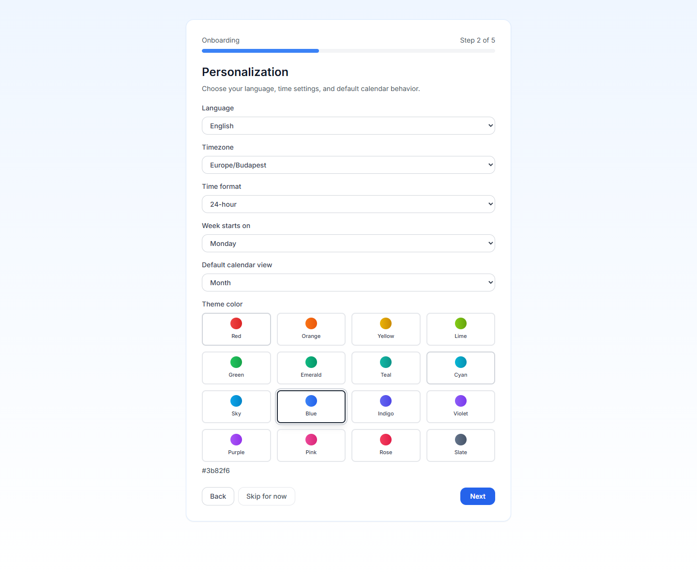

# Erstellen Sie Ihr Konto {#creating-your-account}

PrimeCal beginnt mit einem kompakten Anmeldeformular und geht dann sofort in einen fünfstufigen Onboarding-Assistenten über. Ziel ist es, ab der ersten Sitzung nur die Informationen zu sammeln, die erforderlich sind, um den Kalender nutzbar zu machen.

## Schritt 1: Öffnen Sie „Registrieren“. {#step-1-open-sign-up}

1. Öffnen Sie die Anmeldeseite PrimeCal.
2. Wechseln Sie zu `Sign up`.
3. Füllen Sie die drei sichtbaren Felder aus.
4. Senden Sie `Create account`.

## Registrierungsfelder {#registration-fields}

| Feld | Erforderlich | Was Sie eingeben müssen | Regeln und Einschränkungen |
| --- | --- | --- | --- |
| Benutzername | Ja | Ihr öffentlicher Kontoname | 3 bis 64 Zeichen. Verwenden Sie Buchstaben, Zahlen, Punkte oder Unterstriche. Muss einzigartig sein. |
| E-Mail-Adresse | Ja | Ihre Anmelde-E-Mail | Muss eine gültige E-Mail-Adresse sein und eindeutig sein. |
| Passwort | Ja | Ein sicheres Passwort | Mindestens 6 Zeichen. Der Passwort-Helfer muss ein gültiges Ergebnis anzeigen, bevor Sie fortfahren. |

## Was passiert nach der Registrierung? {#what-happens-after-registration}

Nachdem das Konto erstellt wurde, meldet PrimeCal Sie an und öffnet automatisch den Onboarding-Assistenten. Bis dieser Assistent abgeschlossen ist, bleibt das Produkt auf dem Setup-Pfad und führt Sie nicht in den Hauptarbeitsbereich.

## Schritt 2: Führen Sie die fünf Schritte des Assistenten aus {#step-2-complete-the-five-wizard-steps}

### 1. Willkommensprofil {#1-welcome-profile}

- Optionaler Vorname
- Optionaler Nachname
- Optionales Gravatar-basiertes Profilbild

### 2. Personalisierung {#2-personalization}

- Sprache
- Zeitzone
- Zeitformat
- Wochenstarttag
- Standardkalenderansicht
- Themenfarbe

### 3. Datenschutz und Einwilligung {#3-privacy-and-consent}

- Zustimmung zur Datenschutzerklärung: erforderlich
- Annahme der Nutzungsbedingungen: erforderlich
- Produktaktualisierungen per E-Mail: optional

Sie können die Einrichtung erst abschließen, wenn beide erforderlichen Kontrollkästchen akzeptiert wurden.

### 4. Kalendereinstellungen {#4-calendar-preferences}

- Hauptanwendungsfall: persönlich, geschäftlich, im Team oder anders
- Optionale Anfrage zur späteren Anbindung von Google Kalender
- Optionale Anfrage zur späteren Anbindung von Microsoft Calendar

### 5. Überprüfung {#5-review}

PrimeCal zeigt eine Zusammenfassung der von Ihnen getroffenen Entscheidungen, damit Sie diese vor `Complete Setup` bestätigen können.

## Nach dem Setup {#after-setup}

Wenn der Assistent abgeschlossen ist, werden Sie von PrimeCal zur Haupt-App weitergeleitet mit:

- Ihre Profilgrundlagen wurden gespeichert
- Ihr Gebietsschema und Ihre Anzeigeeinstellungen wurden angewendet
- Datenschutzakzeptanz aufgezeichnet
- ein Standardkalender `Tasks`, der bereits für Sie erstellt wurde

Ihr nächster Schritt sollte [Ersteinrichtung](./initial-setup.md) sein, wo Sie einen normalen Kalender erstellen und Ihre Seitenleiste organisieren.

## Best Practices {#best-practices}

- Wählen Sie die Zeitzone beim ersten Start sorgfältig aus, da sie sich auf jedes Ereignis auswirkt, das Sie danach erstellen.
- Verwenden Sie einen eindeutigen Benutzernamen, den Sie problemlos mit Mitarbeitern teilen können.
- Behandeln Sie die optionalen Synchronisierungsschalter als spätere Einrichtungsoptionen und nicht als etwas, das Sie vor der Verwendung der App abschließen müssen.
- Kehren Sie später zur [Profilseite](../../USER-GUIDE/profile/profile-page.md) zurück, wenn Sie Beschriftungen verfeinern, das Verhalten oder das Erscheinungsbild fokussieren möchten.

## Entwicklerreferenz {#developer-reference}

Wenn Sie den Registrierungsablauf implementieren oder testen, verwenden Sie [Authentifizierung API](../../DEVELOPER-GUIDE/api-reference/authentication-api.md).
