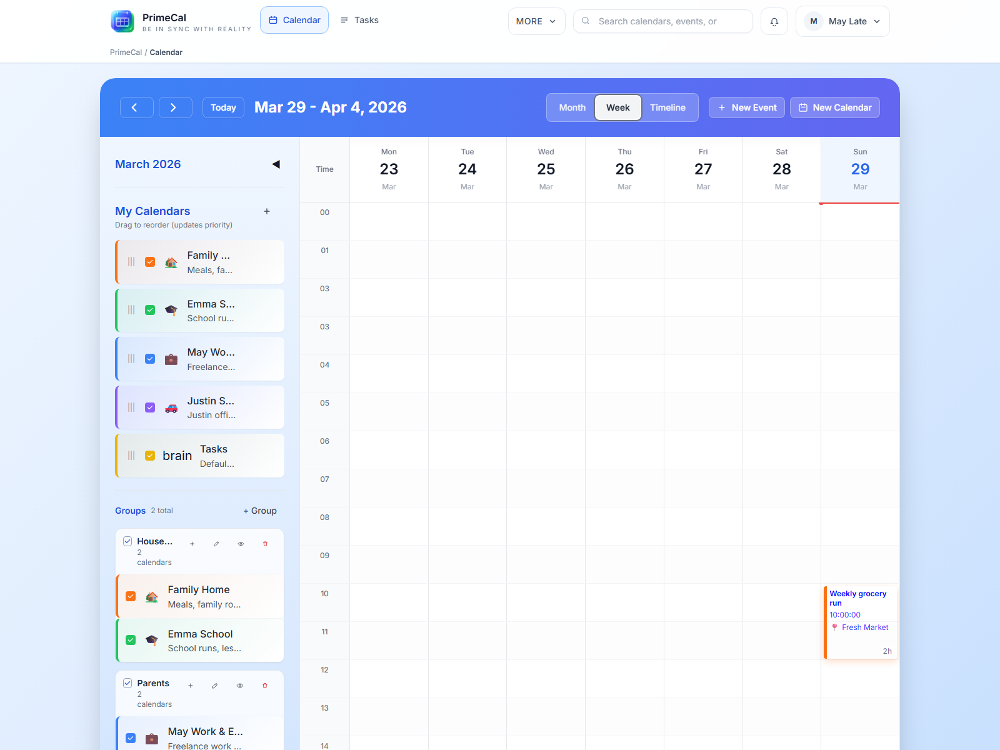

# Erstellen Sie Ihr erstes Event {#creating-your-first-event}

PrimeCal verwendet ein Hauptereignismodal sowohl für die Erstellung als auch für die Bearbeitung. Sobald Sie dieses Modal verstanden haben, verstehen Sie den grundlegenden Planungsworkflow überall in der App.

## Möglichkeiten, eine neue Veranstaltung zu starten {#ways-to-start-a-new-event}

- Klicken Sie auf `New Event`
- Klicken Sie in der Monatsansicht auf einen Tag
- Klicken oder ziehen Sie einen Zeitbereich in der Wochenansicht
- Erstellen Sie direkt aus der Live-Timeline in der Fokusansicht

## Das Event-Modal {#the-event-modal}

## Sichtbare Felder {#visible-fields}

| Feld | Erforderlich | Was es bewirkt | Regeln und Einschränkungen |
| --- | --- | --- | --- |
| Titel | Ja | Name der Hauptveranstaltung | Verwenden Sie einen klaren Namen, der in der Monats- und Wochenansicht leicht zu scannen ist. |
| Kalender | Ja | Wählt aus, wo das Ereignis stattfindet | Wählen Sie vor dem Speichern den richtigen Kalender aus. |
| Starten | Ja | Datum und Uhrzeit des Veranstaltungsbeginns | Erforderlich, es sei denn, die Veranstaltung ist als ganztägig gekennzeichnet. |
| Ende | Ja | Datum und Uhrzeit, zu der die Veranstaltung endet | Muss am selben Tag oder später als der Start sein. |
| Den ganzen Tag | Nein | Entfernt die Tageszeitplanung | Am besten für Geburtstage, Reisetage, Fristen oder Schulferien. |
| Standort | Nein | Treffpunkt oder Adresse | Hilfreich in der Wochen- und Fokusansicht, wenn der Standort wichtig ist. |
| Beschreibung oder Notizen | Nein | Zusätzlicher Kontext | Verwenden Sie es für Tagesordnungsnotizen, Erinnerungen oder Details, die der Titel nicht enthalten sollte. |
| Farbe | Nein | Ereignisspezifische Überschreibung | Lassen Sie es leer, um die Kalenderfarbe zu übernehmen. |
| Etiketten | Nein | Wiederverwendbare Ereignis-Tags | Nützlich für Filter- und Fokusregeln. |
| Wiederholung | Nein | Wiederholt das Ereignis | Verwenden Sie es für Routineaufgaben wie das Abholen von der Schule, wöchentliche Sportveranstaltungen oder wiederkehrende Anrufe. |

## Ein guter erster Event-Flow {#a-good-first-event-flow}

1. Erstellen Sie zunächst einen regulären Kalender, z. B. `Family`.
2. Öffnen Sie das Veranstaltungsmodal aus der von Ihnen bevorzugten Ansicht.
3. Geben Sie einen kurzen Titel ein.
4. Bestätigen Sie den Kalender.
5. Legen Sie Anfang und Ende fest.
6. Fügen Sie Standort, Beschriftungen oder Wiederholungen nur hinzu, wenn sie hilfreich sind.
7. Speichern Sie das Ereignis.

## Wiederholung {#recurrence}

Wiederkehrende Ereignisse werden aus demselben Modal erstellt. Verwenden Sie die Wiederholung für Routinen wie:

- Abholung von der Schule an jedem Wochentag
- Wocheneinkauf
- wiederkehrende Schulungen
- regelmäßige Anrufe

Wenn Sie sich noch nicht sicher sind, erstellen Sie zunächst ein einmaliges Ereignis und fügen Sie später eine Wiederholung hinzu, nachdem Sie das Ereignis im Kalender angezeigt haben.

## Was nach dem Speichern zu überprüfen ist {#what-to-check-after-saving}

- Das Ereignis wird in der richtigen Kalenderfarbe angezeigt
- Die Zeit landet in der Wochenansicht an der richtigen Stelle
- Das Ereignis ist in der Monatsansicht leicht zu finden
- Die Fokusansicht zeigt es zum richtigen Zeitpunkt, wenn es bald passiert

## Best Practices {#best-practices}

- Halten Sie die Titel kurz. Die Ansichten werden viel einfacher zu scannen.
- Verwenden Sie Kalenderfarben für eine umfassende Bedeutung und Ereignisfarben nur, wenn ein bestimmtes Ereignis eine besondere Betonung erfordert.
- Verwenden Sie die Wiederholung für echte Routinen, nicht für unsichere Pläne.
- Überprüfen Sie das Ergebnis nach dem Speichern des Ereignisses in mindestens einer anderen Ansicht.

## Entwicklerreferenz {#developer-reference}

Wenn Sie Ereignisformulare oder Wiederholungsunterstützung implementieren, verwenden Sie [Ereignis API](../../DEVELOPER-GUIDE/api-reference/event-api.md).
