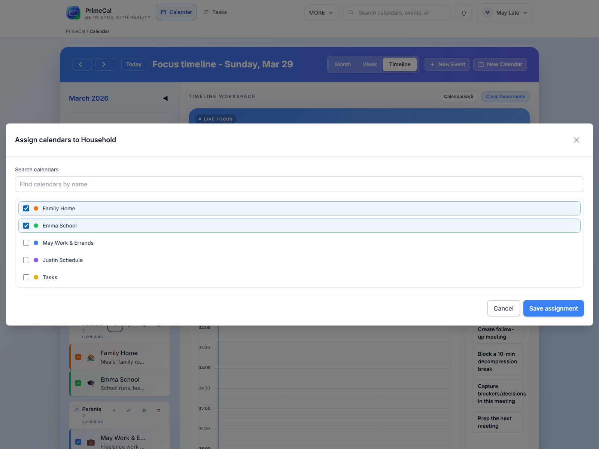

# Ersteinrichtung {#initial-setup}

PrimeCal ist sofort nach dem Onboarding nutzbar, aber die beste erste Aktion besteht darin, einen normalen Kalender zu erstellen und die Seitenleiste entsprechend Ihrer tatsächlichen Arbeitsweise zu organisieren.

## Erstellen Sie einen neuen Kalender {#create-a-new-calendar}

### Wo man klicken kann {#where-to-click}

1. Öffnen Sie `Calendar`.
2. Klicken Sie in der Kalenderseitenleiste auf `New Calendar`.
3. Füllen Sie den Dialog.
4. Speichern Sie den Kalender.

### Kalenderfelder {#calendar-fields}

| Feld | Erforderlich | Was es bewirkt | Regeln und Einschränkungen |
| --- | --- | --- | --- |
| Name | Ja | Name des Hauptkalenders | Halten Sie es kurz und klar. Dies sehen Sie in der Seitenleiste und in den Ereignisformularen. |
| Beschreibung | Nein | Zusätzlicher Kontext | Optionaler Hilfstext für den Kalender. |
| Farbe | Ja | Visuelle Identität | Verwenden Sie eine eindeutige Farbe, da diese Farbe die Ereigniswiedergabe in den Ansichten steuert, sofern sie nicht durch ein Ereignis überschrieben wird. |
| Symbol | Nein | Hinweis in der Seitenleiste | Optionale visuelle Markierung für die Seitenleiste und zugehörige Veranstaltungsoberflächen. |
| Gruppe | Nein | Organisieren Sie gemeinsam Kalender | Weisen Sie den Kalender einer bestehenden Gruppe zu oder lassen Sie die Gruppierung aufgehoben. |

### Gute Erstkalender {#good-first-calendars}

- `Family`
- `Personal`
- `Work`
- `School`

## Kalendergruppen {#calendar-groups}

Gruppen helfen, wenn Sie mehrere Kalender in der Seitenleiste haben. Sie ersetzen keine Kalender. Sie organisieren sie einfach.

### Erstellen Sie eine Gruppe {#create-a-group}

Sie können im Kalenderbereich bei Bedarf eine Gruppe erstellen.

- Klicken Sie in der Seitenleiste auf die Gruppenerstellungsaktion oder im Kalenderdialog auf die Option „Inline-Gruppe“.
- Geben Sie einen eindeutigen Namen ein, z. B. `Family`, `Work` oder `Shared`.
- Speichern Sie die Gruppe.

### Benennen Sie eine Gruppe um {#rename-a-group}

- Öffnen Sie die Gruppenaktionen.
- Wählen Sie „Umbenennen“.
- Speichern Sie den neuen Namen.

### Kalender zuweisen oder ihre Zuweisung aufheben {#assign-or-unassign-calendars}

- Öffnen Sie die Gruppenzuweisungssteuerung.
- Wählen Sie die Kalender aus, die zur Gruppe gehören sollen.
- Speichern Sie die Änderungen.

Kalender können auch später aus einer Gruppe entfernt werden, ohne sie zu löschen.

### Eine Gruppe ausblenden oder anzeigen {#hide-or-show-a-group}

Verwenden Sie die Sichtbarkeitssteuerung für die Gruppe, wenn Sie das gesamte Set auf einmal ein- oder ausblenden möchten. Dies ist die schnellste Möglichkeit, den Arbeitsplatz ruhiger zu machen.

### Eine Gruppe löschen {#delete-a-group}

Durch das Löschen einer Gruppe wird der Container entfernt, nicht die darin enthaltenen Kalender. Die Kalender bleiben als nicht gruppierte Kalender verfügbar.

## Wie Farben und Sichtbarkeit die Ansichten beeinflussen {#how-colors-and-visibility-affect-the-views}

- Die Kalenderfarbe erscheint in der Seitenleiste und wird zur Standard-Ereignisfarbe.
- Ausgeblendete Kalender verschwinden aus der Fokus-, Monats- und Wochenansicht.
- Die Gruppensichtbarkeit wirkt sich auf jeden Kalender innerhalb dieser Gruppe aus, bis Sie ihn erneut anzeigen.
- Farben auf Ereignisebene können weiterhin die Kalenderfarbe für ein bestimmtes Ereignis überschreiben.

## Best Practices {#best-practices}

- Erstellen Sie einen oder zwei echte Kalender, bevor Sie viele Ereignisse erstellen.
- Verwenden Sie Gruppen nur, wenn sie beim Scannen hilfreich sind. Normalerweise reicht eine Gruppe pro realem Bereich aus.
- Wählen Sie Farben, die auf den ersten Blick optisch erkennbar sind.
- Behalten Sie den Standardkalender `Tasks` für Aufgaben bei. Verwenden Sie normale Kalender für Termine, Schule, Reisen und Familienplanung.

## Entwicklerreferenz {#developer-reference}

Wenn Sie eine Kalender- oder Gruppenverwaltung implementieren, verwenden Sie [Calendar API](../../DEVELOPER-GUIDE/api-reference/calendar-api.md).
