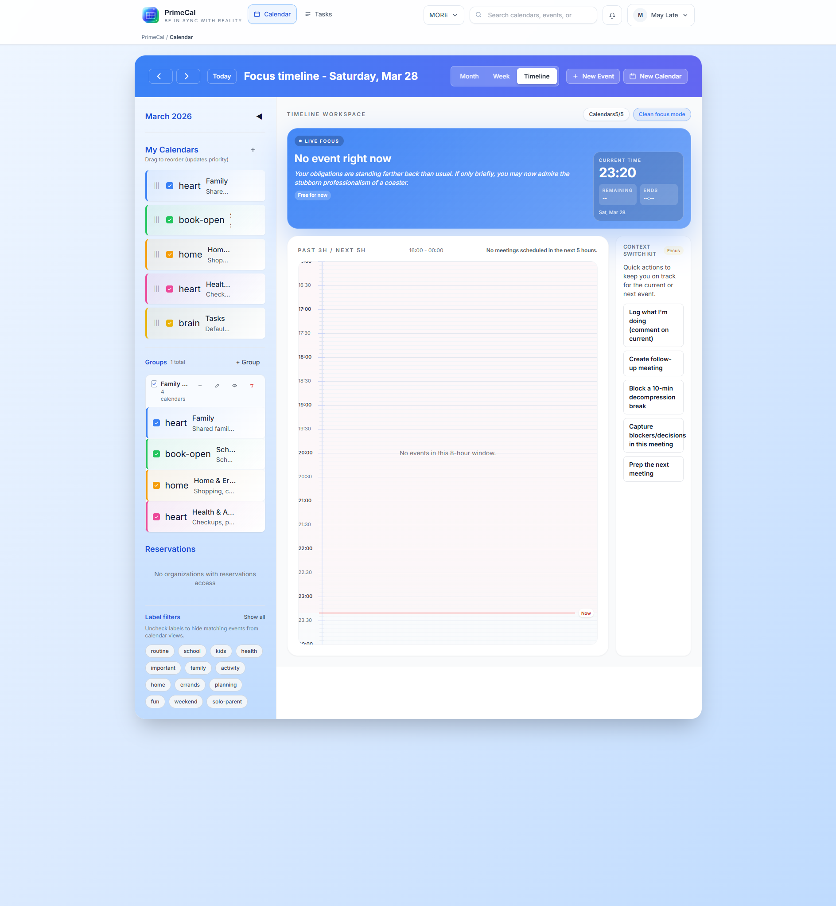

  
Schneller Pfad

  <h1 class="pc-guide-hero__title">Kurzanleitung</h1>
  
Verwenden Sie diese Seite, wenn Sie die vollständige Erstausführungssequenz an einem Ort haben möchten. Es spiegelt die gleichen Bildschirme wider, die ein neuer PrimeCal-Benutzer im Live-Produkt sieht.

  

    Kontoerstellung
    Onboarding-Assistent
    Kalendergruppen
    Erstes Ereignis
  

## Der schnelle Weg {#the-fast-path}

  <article class="pc-guide-flow__item">
    
1

    <h3>Erstellen Sie Ihr Konto</h3>
    
Öffnen Sie `Sign up`, geben Sie Ihren Benutzernamen, Ihre E-Mail-Adresse und Ihr Passwort ein und senden Sie dann `Create account`.

  </article>
  <article class="pc-guide-flow__item">
    
2

    <h3>Schließen Sie den Assistenten ab</h3>
    
Schließen Sie die fünf Onboarding-Schritte für Profil, Personalisierung, Datenschutz, Kalendereinstellungen und Überprüfung ab.

  </article>
  <article class="pc-guide-flow__item">
    
3

    <h3>Erstellen Sie Ihren Kalender</h3>
    
Verwenden Sie `New Calendar`, um einen normalen Kalender wie `Family`, `Personal` oder `Work` zu erstellen.

  </article>
  <article class="pc-guide-flow__item">
    
4

    <h3>Gruppen organisieren</h3>
    
Erstellen Sie eine Gruppe, wenn Sie mehrere Kalender in der Seitenleiste zusammenhalten möchten.

  </article>
  <article class="pc-guide-flow__item">
    
5

    <h3>Erstellen Sie Ihr erstes Event</h3>
    
Verwenden Sie `New Event` oder klicken Sie direkt in einer Kalenderansicht und speichern Sie dann das Ereignis über das gemeinsame Modal.

  </article>

## Was Sie konfigurieren werden {#what-you-will-configure}

- Kontoidentität und sichere Anmeldung
- Sprache, Zeitzone, Zeitformat, Wochenstart und Standardansicht
- Datenschutzakzeptanz und optionale Zustimmung zur Produktaktualisierung
- mindestens einen regulären Kalender und optionale Kalendergruppen
- das erste echte Ereignis im Monats-, Wochen- oder Fokus-Workflow

## Bildschirme, die Sie sehen werden {#screens-you-will-see}

## Best Practices für neue Benutzer {#best-practices-for-new-users}

- Schließen Sie den vollständigen Onboarding-Prozess ab, bevor Sie versuchen, erweiterte Funktionen wie Synchronisierung, Automatisierung oder KI-Agenten zu konfigurieren.
- Erstellen Sie einen regulären Kalender, bevor Sie viele Ereignisse erstellen, damit sich Ihr Tagesplan nicht mit dem Standardaufgabenkalender vermischt.
- Wählen Sie frühzeitig Kalenderfarben aus und sorgen Sie dafür, dass sie im Familien-, Arbeits- und Privatbereich einheitlich sind.
- Fügen Sie nur die Gruppen hinzu, die Sie benötigen. Zu viele Gruppen erschweren das Durchsuchen der Seitenleiste.

## Fahren Sie mit den Detailseiten fort {#continue-with-the-detailed-pages}

1. [Erstellen Ihres Kontos](./first-steps/creating-your-account.md)
2. [Ersteinrichtung](./first-steps/initial-setup.md)
3. [Erstellen Sie Ihr erstes Event](./first-steps/creating-your-first-event.md)
4. [Benutzerdokumentation](../USER-GUIDE/index.md)
