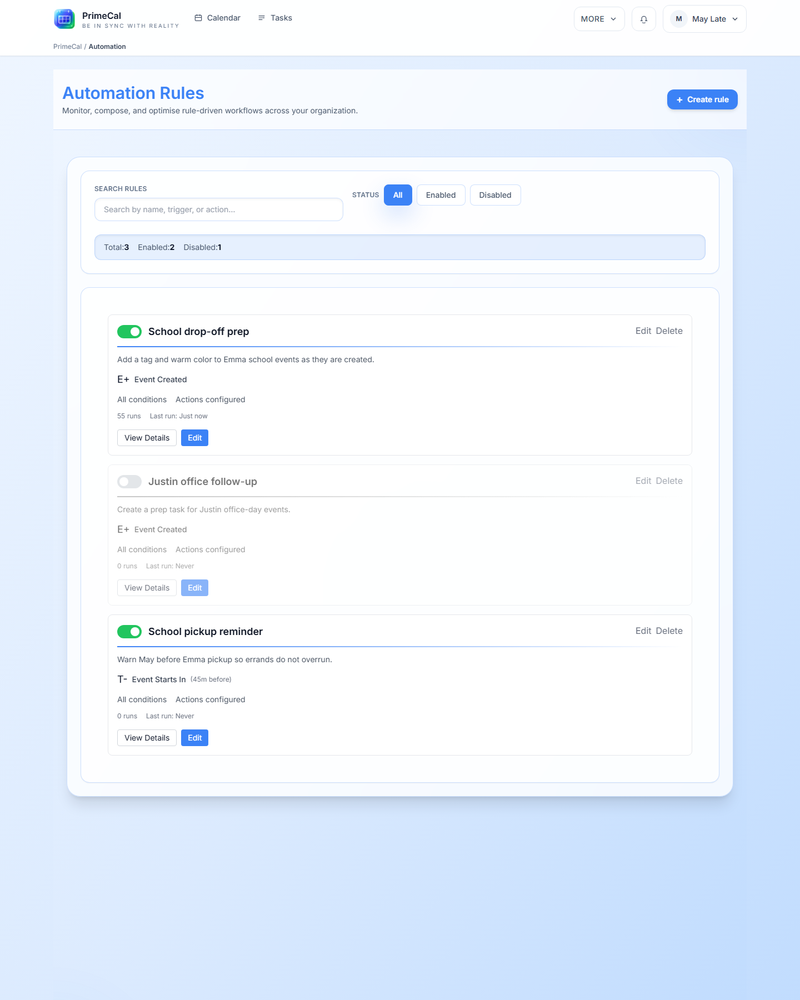

# Automatisierungen verwalten und ausführen {#managing-and-running-automations}

Nachdem eine Regel vorhanden ist, erfolgt die tägliche Arbeit in der Automatisierungsliste und auf den Detailseiten.

## Filtern Sie die Regelliste {#filter-the-rule-list}

Verwenden Sie die Listenseite, um die gewünschte Regel zu finden, bevor Sie sie bearbeiten oder ausführen.

- Suchen Sie nach Regelname, Auslöser oder Aktionszusammenfassung.
- Verwenden Sie die Filter `All`, `Enabled` und `Disabled`, um die Liste einzugrenzen.
- Lesen Sie die Laufanzahl und die `Last run`-Werte direkt von jeder Regelkarte.

## Öffnen Sie eine Regeldetailseite {#open-a-rule-detail-page}

Wählen Sie eine Regel aus, um Folgendes zu überprüfen:

- Auslöser
- Bedingungslogik
- konfigurierte Aktionen
- Gesamtanzahl der Ausführungen
- Zeitstempel der letzten Ausführung

Auf der Detailseite werden auch `Run Now`, `Edit` und `Delete` angezeigt.

## Führen Sie eine Regel manuell aus {#run-a-rule-manually}

Verwenden Sie `Run Now`, wenn Sie eine Regel anhand vorhandener Ereignisse testen möchten, anstatt darauf zu warten, dass der Auslöser auf natürliche Weise ausgelöst wird.

- PrimeCal verarbeitet übereinstimmende Ereignisse und schreibt das Ergebnis in den Prüfverlauf.
- Übersprungene Ereignisse werden weiterhin im Verlauf angezeigt, sodass Sie sehen können, warum die Regel nicht angewendet wurde.

## Überprüfen Sie den Ausführungsverlauf {#review-execution-history}

Die Registerkarte `Execution History` ist der schnellste Weg, um zu überprüfen, ob eine Regel das Richtige tut.

- Nach Status filtern
- Ändern Sie den Datumsbereich
- Überprüfen Sie erfolgreiche, übersprungene, teilweise erfolgreiche und fehlgeschlagene Zeilen
- Verwenden Sie die Ereigniszeile, um zu verstehen, welche Elemente berührt wurden

