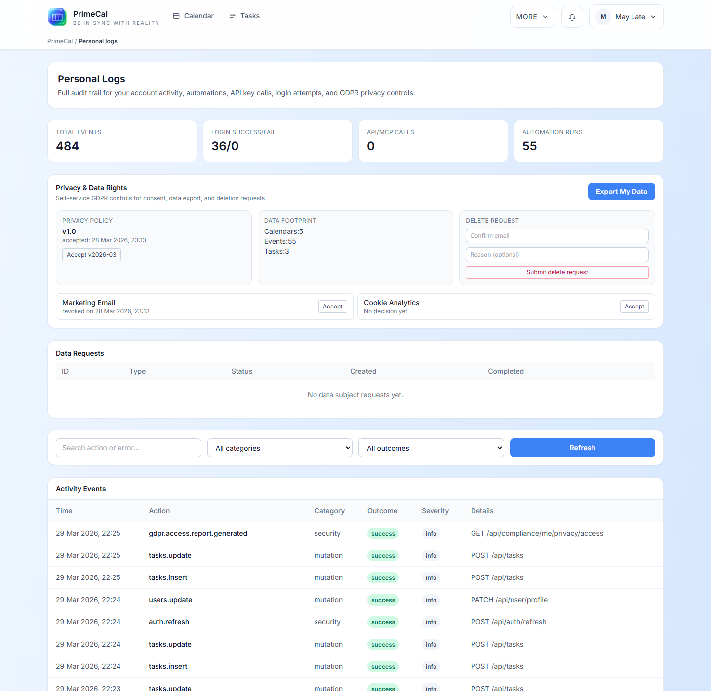

# Persönliche Protokolle {#personal-logs}

Persönliche Protokolle sind Ihr privater Aktivitäts- und Datenschutzbildschirm. Es hilft Ihnen zu verstehen, was in Ihrem Konto passiert ist, ohne systemweite Administratordaten preiszugeben.

## So öffnen Sie es {#how-to-open-it}

1. Öffnen Sie `More`.
2. Wählen Sie `Personal logs`.

## Was Sie überprüfen können {#what-you-can-review}

| Abschnitt | Was es zeigt |
| --- | --- |
| Zusammenfassungskarten | Ein kurzer Überblick über die letzten Aktivitäten und das Kontoverhalten |
| Datenschutzmaßnahmen | Persönliche Export- oder datenschutzbezogene Aktionen, die für Ihr Konto verfügbar sind |
| Aktivitätsfeed | Detaillierte Aufzeichnungen mit Zeitstempeln und Ergebnissen |
| Filter | Grenzen Sie die Liste ein, damit Sie bestimmte Aktionen schneller finden können |

## Aktivitätstabelle {#activity-table}

Die Aktivitätstabelle ist nützlich, wenn Sie Fragen beantworten möchten wie:

- Was hat sich in letzter Zeit geändert?
- Ist die Anmeldung fehlgeschlagen oder erfolgreich?
- Wann wurde eine Datenschutzmaßnahme angefordert?
- Haben automatisierungsbezogene Aktivitäten mein Konto beeinträchtigt?

## Best Practices {#best-practices}

- Verwenden Sie diese Seite als privates Überprüfungstool, nicht als gemeinsames Audit-Dashboard.
- Überprüfen Sie es nach ungewöhnlichem Anmeldeverhalten oder Datenschutzänderungen.
- Passen Sie die Profileinstellungen und Datenschutzoptionen an das an, was Sie hier sehen.
- Wenn Sie nur die Einstellungen ändern müssen, kehren Sie zur [Profilseite](../profile/profile-page.md) zurück.

## Entwicklerreferenz {#developer-reference}

Für die benutzereigenen Prüfrouten hinter diesem Bildschirm verwenden Sie [Persönliche Protokolle API](../../DEVELOPER-GUIDE/api-reference/personal-logs-api.md).
