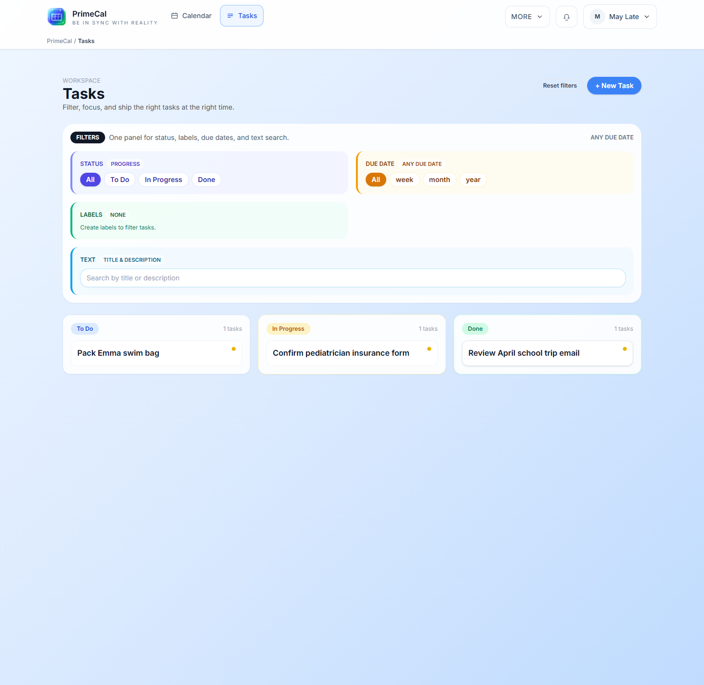

# FAQ de dépannage {#troubleshooting-faq}

Cette page concerne le moment où quelque chose existe dans PrimeCal, mais l'écran ne se comporte pas comme prévu.

## Un événement existe, mais je ne le trouve pas. Que dois-je vérifier en premier ? {#an-event-exists-but-i-cannot-find-it-what-should-i-check-first}

**Réponse courte :** vérifiez la visibilité avant de vérifier tout le reste.

Travaillez dans cet ordre :

1. confirmez que le calendrier est visible dans la barre latérale
2. confirmez que vous regardez la bonne plage de dates
3. confirmer que l'événement n'est pas filtré par les règles d'étiquette Focus uniquement
4. confirmez que votre fuseau horaire et l'heure de votre événement correspondent à ce que vous pensez

Le mois et la semaine sont généralement les endroits les plus rapides pour confirmer si l'événement est réellement manquant ou simplement filtré.

## Pourquoi un événement apparaît-il dans Mois ou Semaine mais pas dans Focus ? {#why-does-an-event-appear-in-month-or-week-but-not-in-focus}

**Réponse courte :** La mise au point est filtrée de manière plus agressive par la conception.

La raison habituelle est que l'événement porte une étiquette masquée dans le Focus en direct, ou que le moment en direct en cours ne correspond plus à l'événement que vous attendiez.

## La date d'échéance d'une tâche n'est pas celle à laquelle je m'attendais. Qu’est-ce qui contrôle cela ? {#a-task-due-date-is-not-where-i-expected-what-controls-that}

**Réponse courte :** le calendrier des tâches par défaut contrôle l'endroit où la synchronisation des tâches en miroir apparaît.

Si le timing des tâches semble étrange, revérifiez :

- si la tâche a une date d'échéance
- si le délai d'échéance a été intentionnellement laissé vide
- quel calendrier fait office de calendrier des tâches par défaut

Pour une explication complète, utilisez [Espace de travail de tâches](../USER-GUIDE/tasks/tasks-workspace.md) et [Page de profil](../USER-GUIDE/profile/profile-page.md).

## Pourquoi mon automatisation n’a-t-elle pas fonctionné ? {#why-did-my-automation-not-run}

**Réponse courte :** la plupart des échecs proviennent du fait que la règle n'est pas activée, que le déclencheur ne correspond pas ou qu'une condition filtre l'événement.

Vérifiez-les dans l'ordre :

1. la règle est activée
2. le déclencheur correspond au changement réel de l'événement
3. les conditions ne sont pas trop étroites
4. l'action est toujours valable pour les données qu'elle reçoit
5. l'historique d'exécution montre ce qui s'est passé

## Pourquoi mon agent ne peut-il pas effectuer une action qu’il effectuait auparavant ? {#why-cant-my-agent-perform-an-action-it-used-to-perform}

**Réponse courte :** la portée, la clé ou les actions autorisées ont probablement changé.

Revérifiez :

- si l'agent a toujours l'action requise activée
- si le calendrier ou la règle spécifique est toujours dans la portée
- si la clé a été révoquée ou pivotée
- si vous pointez le client vers la dernière configuration MCP générée

## Pourquoi la synchronisation externe semble-t-elle obsolète après avoir modifié les paramètres du fournisseur ? {#why-does-external-sync-look-stale-after-i-changed-provider-settings}

**Réponse courte :** Les connexions de synchronisation sont plus faciles à récupérer en les simplifiant, et non en superposant davantage de modifications sur un mappage interrompu.

Réduisez la configuration au plus petit cas de test utile, puis reconnectez-vous proprement si le compte du fournisseur ou le mappage a changé. Ceci est particulièrement important après avoir changé de compte Google ou Microsoft.

## Quand dois-je arrêter le dépannage et ouvrir les documents plus profonds ? {#when-should-i-stop-troubleshooting-and-open-the-deeper-docs}

Passez de la FAQ aux documents complets lorsque :

- vous avez besoin du chemin de clic exact, pas seulement d'une réponse rapide
- vous modifiez plusieurs fonctionnalités à la fois
- le problème englobe la synchronisation, l'automatisation et les agents

Utilisez ensuite ces pages :

- [Vues du calendrier](../USER-GUIDE/basics/calendar-views.md)
- [Mode de mise au point et mise au point en direct](../USER-GUIDE/basics/focus-mode-and-live-focus.md)
- [Gestion et exécution des automatisations](../USER-GUIDE/automation/managing-and-running-automations.md)
- [Synchronisation externe](../USER-GUIDE/integrations/external-sync.md)
