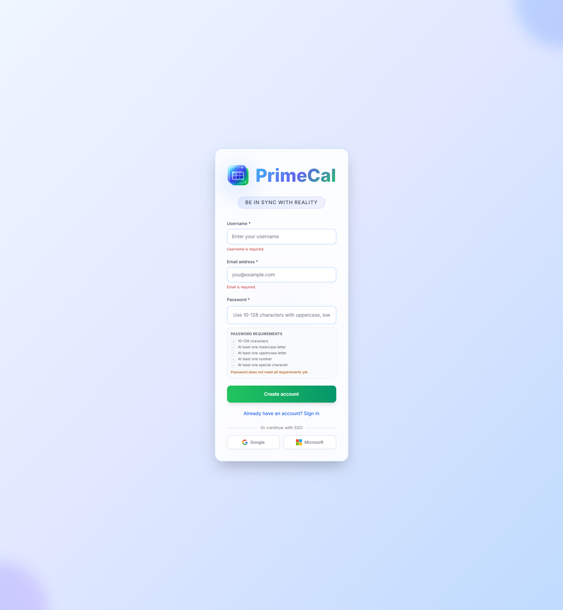
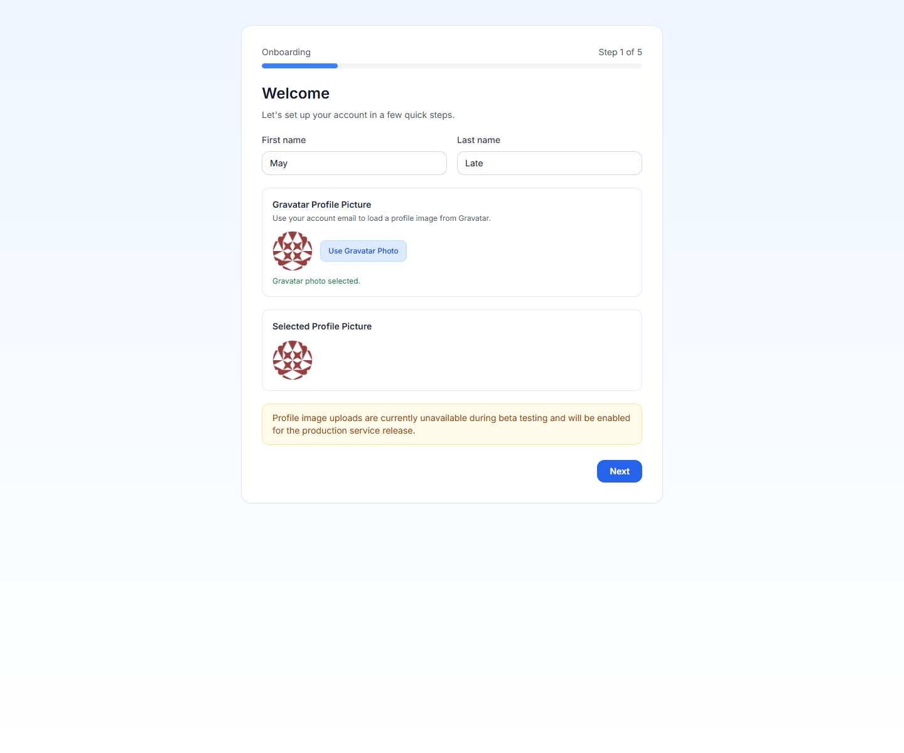

# Création de votre compte {#creating-your-account}

PrimeCal commence par un formulaire d'inscription compact, puis passe immédiatement à un assistant d'intégration en cinq étapes. Le but est de collecter uniquement les informations nécessaires pour rendre le calendrier utilisable dès la première session.

## Étape 1 : Ouvrez l'inscription {#step-1-open-sign-up}

1. Ouvrez la page de connexion PrimeCal.
2. Passez à `Sign up`.
3. Remplissez les trois champs visibles.
4. Soumettez `Create account`.

## Champs d'inscription {#registration-fields}

| Champ | Obligatoire | Que saisir | Règles et contraintes |
| --- | --- | --- | --- |
| Nom d'utilisateur | Oui | Le nom de votre compte public | 3 à 64 caractères. Utilisez des lettres, des chiffres, des points ou des traits de soulignement. Doit être unique. |
| Adresse e-mail | Oui | Votre email de connexion | Doit être une adresse e-mail valide et doit être unique. |
| Mot de passe | Oui | Un mot de passe sécurisé | Minimum 6 caractères. L'assistant de mot de passe doit afficher un résultat valide avant de continuer. |

## Que se passe-t-il après l'inscription {#what-happens-after-registration}

Une fois le compte créé, PrimeCal vous connecte et ouvre automatiquement l'assistant d'intégration. Jusqu'à ce que cet assistant soit terminé, le produit vous maintient sur le chemin de configuration au lieu de vous rediriger vers l'espace de travail principal.

## Étape 2 :  complétez les cinq étapes de l'assistant {#step-2-complete-the-five-wizard-steps}

### 1. Profil de bienvenue {#1-welcome-profile}

- Prénom facultatif
- Nom de famille facultatif
- Image de profil facultative basée sur Gravatar

### 2. Personnalisation {#2-personalization}

- Langue
- Fuseau horaire
- Format de l'heure
- Jour de début de semaine
- Vue du calendrier par défaut
- Couleur du thème

### 3. Confidentialité et consentement {#3-privacy-and-consent}

- Acceptation de la politique de confidentialité : obligatoire
- Acceptation des conditions d'utilisation : obligatoire
- Mises à jour du produit par e-mail : facultatif

Vous ne pouvez pas terminer la configuration tant que les deux cases obligatoires ne sont pas acceptées.

### 4. Préférences du calendrier {#4-calendar-preferences}

- Cas d'utilisation principal : personnel, entreprise, équipe ou autre
- Demande facultative pour connecter Google Agenda ultérieurement
- Demande facultative pour connecter Microsoft Calendar ultérieurement

### 5. Révision {#5-review}

PrimeCal affiche un résumé des choix que vous avez faits afin que vous puissiez les confirmer avant `Complete Setup`.

## Après l'installation {#after-setup}

Une fois l'assistant terminé, PrimeCal vous envoie dans l'application principale avec :

- les bases de votre profil enregistrées
- vos paramètres régionaux et vos préférences d'affichage appliquées
- acceptation de la confidentialité enregistrée
- un calendrier `Tasks` par défaut déjà créé pour vous

Votre prochaine étape devrait être [Configuration initiale](./initial-setup.md), où vous créez un calendrier normal et organisez votre barre latérale.

## Meilleures pratiques {#best-practices}

- Choisissez soigneusement le fuseau horaire lors de la première exécution, car il affecte chaque événement que vous créez par la suite.
- Utilisez un nom d'utilisateur distinct que vous êtes à l'aise de partager avec vos collaborateurs.
- Considérez les bascules de synchronisation facultatives comme des choix de configuration ultérieurs, et non comme quelque chose que vous devez terminer avant d'utiliser l'application.
- Revenez à la [Page de profil](../../USER-GUIDE/profile/profile-page.md) plus tard si vous souhaitez affiner les étiquettes, le comportement du focus ou l'apparence.

## Référence du développeur {#developer-reference}

Si vous implémentez ou testez le flux d'enregistrement, utilisez l'[Authentification API](../../DEVELOPER-GUIDE/api-reference/authentication-api.md).
