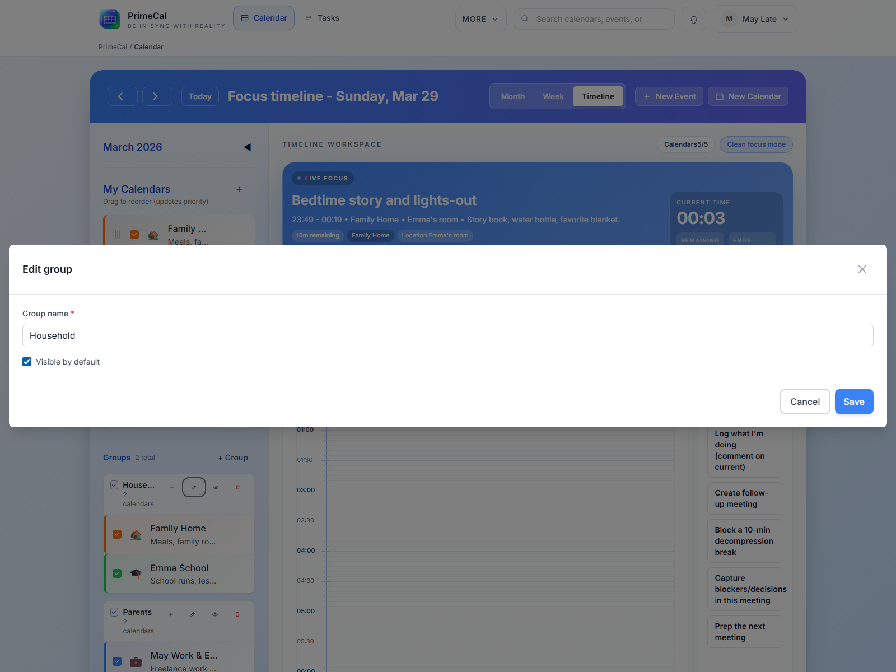

# Configuration initiale {#initial-setup}

PrimeCal est utilisable immédiatement après l'intégration, mais la meilleure première action consiste à créer un calendrier normal et à organiser la barre latérale en fonction de votre façon de travailler réellement.

## Créer un nouveau calendrier {#create-a-new-calendar}

### Où cliquer {#where-to-click}

1. Ouvrez `Calendar`.
2. Dans la barre latérale du calendrier, cliquez sur `New Calendar`.
3. Remplissez la boîte de dialogue.
4. Enregistrez le calendrier.

### Champs du calendrier {#calendar-fields}

| Champ | Obligatoire | Ce que ça fait | Règles et contraintes |
| --- | --- | --- | --- |
| Nom | Oui | Nom du calendrier principal | Soyez bref et clair. C'est ce que vous verrez dans la barre latérale et dans les formulaires d'événements. |
| Descriptif | Non | Contexte supplémentaire | Texte d'aide facultatif pour le calendrier. |
| Couleur | Oui | Identité visuelle | Utilisez une couleur distincte, car cette couleur détermine le rendu des événements dans les vues, à moins qu'un événement ne la remplace. |
| Icône | Non | Indicateur de la barre latérale | Marqueur visuel facultatif pour la barre latérale et les surfaces d’événements associées. |
| Groupe | Non | Organisez les calendriers ensemble | Attribuez le calendrier à un groupe existant ou laissez-le non groupé. |

### Bons premiers calendriers {#good-first-calendars}

- `Family`
- `Personal`
- `Work`
- `School`

## Groupes de calendrier {#calendar-groups}

Les groupes sont utiles lorsque vous avez plusieurs calendriers dans la barre latérale. Ils ne remplacent pas les calendriers. Ils les organisent simplement.

### Créer un groupe {#create-a-group}

Vous pouvez créer un groupe à partir de la zone du calendrier lorsque vous en avez besoin.

- Cliquez sur l'action de création de groupe dans la barre latérale ou sur l'option de groupe en ligne dans la boîte de dialogue du calendrier.
- Entrez un nom clair tel que `Family`, `Work` ou `Shared`.
- Enregistrez le groupe.

### Renommer un groupe {#rename-a-group}

- Ouvrez les actions de groupe.
- Choisissez Renommer.
- Enregistrez le nouveau nom.

### Attribuer ou annuler l'attribution de calendriers {#assign-or-unassign-calendars}

- Ouvrez le contrôle d'affectation de groupe.
- Sélectionnez les calendriers qui doivent appartenir au groupe.
- Enregistrez les modifications.

Les calendriers peuvent également être supprimés d'un groupe ultérieurement sans les supprimer.

### Masquer ou afficher un groupe {#hide-or-show-a-group}

Utilisez le contrôle de visibilité sur le groupe lorsque vous souhaitez masquer ou révéler l'ensemble de l'ensemble en même temps. C'est le moyen le plus rapide de calmer l'espace de travail.

### Supprimer un groupe {#delete-a-group}

La suppression d'un groupe supprime le conteneur, pas les calendriers qu'il contient. Les calendriers restent disponibles sous forme de calendriers non groupés.

## Comment les couleurs et la visibilité affectent les vues {#how-colors-and-visibility-affect-the-views}

- La couleur du calendrier apparaît dans la barre latérale et devient la couleur de l'événement par défaut.
- Les calendriers masqués disparaissent des vues Focus, Mois et Semaine.
- La visibilité du groupe affecte chaque calendrier de ce groupe jusqu'à ce que vous l'affichiez à nouveau.
- Les couleurs au niveau de l'événement peuvent toujours remplacer la couleur du calendrier pour un événement spécifique.

## Meilleures pratiques {#best-practices}

- Créez un ou deux vrais calendriers avant de créer de nombreux événements.
- Utilisez les groupes uniquement lorsqu'ils facilitent la numérisation. Un groupe par zone du monde réel suffit généralement.
- Choisissez des couleurs visuellement distinctes en un coup d’œil.
- Conservez le calendrier `Tasks` par défaut pour les tâches. Utilisez des calendriers réguliers pour les rendez-vous, l'école, les voyages et la planification familiale.

## Référence du développeur {#developer-reference}

Si vous implémentez la gestion de calendrier ou de groupe, utilisez le [Calendrier API](../../DEVELOPER-GUIDE/api-reference/calendar-api.md).
