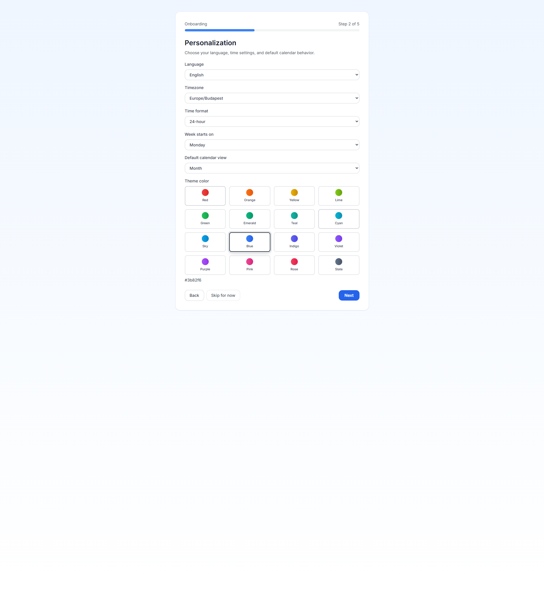

  
Première exécution de PrimeCal

  <h1 class="pc-guide-hero__title">Installez-vous sans deviner</h1>
  
Ces guides suivent le véritable chemin de première exécution dans PrimeCal : créez un compte, complétez l'assistant d'intégration, créez un calendrier régulier, organisez des groupes et enregistrez le premier événement.

  

    Inscription
    Étapes de l'assistant
    Configuration du calendrier
    Captures d'écran réelles
  

## Chemin de première exécution {#first-run-path}

  <article class="pc-guide-card pc-guide-card--accent">
    
Présentation

    <h3><a href="/GETTING-STARTED/quick-start-guide">Guide de démarrage rapide</a></h3>
    
Lisez le chemin d'installation complet en un seul passage avant de plonger dans les pages détaillées.

  </article>
  <article class="pc-guide-card">
    
Compte

    <h3><a href="/GETTING-STARTED/first-steps/creating-your-account">Création de votre compte</a></h3>
    
Inscrivez-vous, réussissez la validation en direct et effectuez les cinq étapes d'intégration avec le comportement de terrain actuel.

  </article>
  <article class="pc-guide-card">
    
Configuration

    <h3><a href="/GETTING-STARTED/first-steps/initial-setup">Configuration initiale</a></h3>
    
Créez un calendrier normal, créez des groupes, renommez-les, attribuez des calendriers et gardez l'espace de travail bien rangé dès le premier jour.

  </article>
  <article class="pc-guide-card">
    
Événements

    <h3><a href="/GETTING-STARTED/first-steps/creating-your-first-event">Création de votre premier événement</a></h3>
    
Utilisez correctement le modal d'événement partagé, comprenez les champs visibles et enregistrez le premier événement en toute confiance.

  </article>

## Que se passe-t-il en premier {#what-happens-first}

  <article class="pc-guide-flow__item">
    
1

<h3>S'inscrire</h3>
    
Créez le compte avec un nom d'utilisateur, une adresse e-mail et un mot de passe.

  </article>
  <article class="pc-guide-flow__item">
    
2

    <h3>Terminer l'intégration</h3>
    
Choisissez votre langue, votre fuseau horaire, vos paramètres de semaine et vos choix de conformité dans l'assistant guidé.

  </article>
  <article class="pc-guide-flow__item">
    
3

    <h3>Créer un vrai calendrier</h3>
    
Le calendrier `Tasks` par défaut est utile pour la capture de tâches, mais la plupart des utilisateurs devraient ajouter immédiatement un calendrier normal.

  </article>
  <article class="pc-guide-flow__item">
    
4

    <h3>Démarrer la planification</h3>
    
Créez le premier événement, puis continuez avec les vues Mois, Semaine et Focus dans le guide de l'utilisateur.

  </article>

## À quoi ressemble la configuration {#what-the-setup-looks-like}

  <article class="pc-guide-shot">
    
Inscription

    <h3 class="pc-guide-shot__title">Formulaire d'inscription</h3>
    
  </article>
  <article class="pc-guide-shot">
    
Intégration

    <h3 class="pc-guide-shot__title">Étape de personnalisation</h3>
    
  </article>
  <article class="pc-guide-shot">
    
Configuration du calendrier

    <h3 class="pc-guide-shot__title">Créer une boîte de dialogue de calendrier</h3>
    
  </article>
  <article class="pc-guide-shot">
    
Premier événement

    <h3 class="pc-guide-shot__title">Modal d'événement</h3>
    
  </article>

:::warning Créer un calendrier normal plus tôt
PrimeCal crée automatiquement un calendrier `Tasks` privé afin que l'espace de travail Tâches fonctionne immédiatement. Cela ne remplace pas un calendrier familial, personnel ou professionnel normal, la plupart des utilisateurs doivent donc en créer un lors de la configuration initiale.
:::
