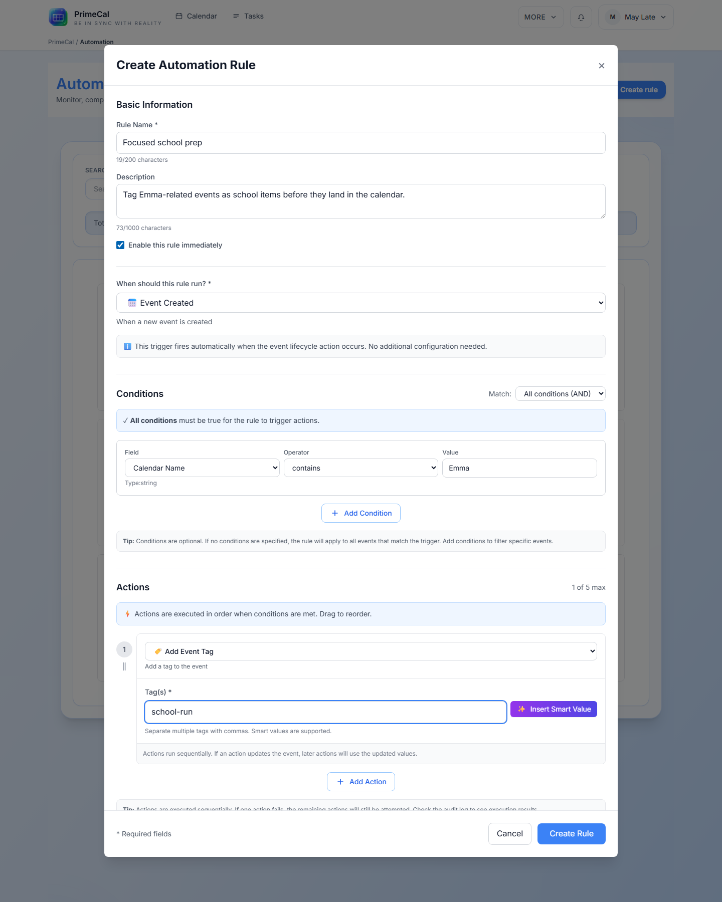

# Création de règles d'automatisation {#creating-automation-rules}

  
Générateur de règles

  <h1 class="pc-guide-hero__title">Créer une règle dans l'interface utilisateur actuelle</h1>
  
L'écran d'automatisation utilise un modal dédié pour créer une règle à la fois. Il prend en charge la création et l'édition, conserve la validation côté client et expose les outils webhook lorsque le déclencheur sélectionné en a besoin.

  

    Nom et description
    Bascule activée
    Sélecteur de déclenchement
    Conditions et actions
  

## Ouvrez le constructeur {#open-the-builder}

1. Ouvrez la page d'automatisation.
2. Cliquez sur `Create Automation Rule`.
3. Remplissez le modal de haut en bas.

Le même modal est utilisé pour modifier une règle existante. L'étiquette du bouton devient `Update Rule` lorsque vous modifiez.

## Champs dans le modal {#fields-in-the-modal}

  <article class="pc-guide-api">
    
Obligatoire

    <h3>Nom</h3>
    
Obligatoire, 1 à 200 caractères. Il s'agit du nom de règle lisible par l'homme affiché dans la liste et la page de détails.

  </article>
  <article class="pc-guide-api">
    
Facultatif

    <h3>Description</h3>
    
Zone de texte facultative, jusqu'à 1 000 caractères, utilisée uniquement pour votre propre contexte.

  </article>
  <article class="pc-guide-api">
    
État

    <h3>Activé</h3>
    
Activé par défaut. Effacez-le si vous souhaitez enregistrer la règle mais la garder inactive.

  </article>
  <article class="pc-guide-api">
    
Obligatoire

    <h3>Déclencheur</h3>

Doit être choisi avant la sauvegarde. Le déclencheur contrôle quel panneau de configuration apparaît en dessous.

  </article>

## Règles de validation {#validation-rules}

- Le nom est requis.
- Un déclencheur est requis.
- Les déclencheurs à temps relatif nécessitent un décalage valide non négatif.
- Vous pouvez garder les conditions vides, mais l'éditeur en autorise un maximum de 10.
- Vous devez définir au moins une action.
- Vous pouvez ajouter jusqu'à 5 actions.
- Les actions non prises en charge ou à venir ne peuvent pas être enregistrées.

## Enregistrer le comportement {#save-behavior}

- `Create Rule` stocke la nouvelle règle.
- `Update Rule` remplace la règle existante.
- La liste des règles est actualisée après l'enregistrement.
- Si vous souhaitez qu'une règle s'exécute immédiatement après sa création, utilisez la page de détail de la règle et `Run Now`, ou créez-la, puis exécutez-la à partir de l'écran de détail.

## Règles des webhooks {#webhook-rules}

Si vous choisissez le déclencheur `Incoming Webhook` :

- La règle expose un jeton de webhook généré.
- Le modal affiche la configuration du webhook une fois le déclencheur sélectionné.
- L'URL du webhook générée peut être copiée pour les systèmes externes.

## Voir aussi {#see-also}

- [Déclencheurs et conditions](./triggers-and-conditions.md)
- [Aperçu des actions](./actions-overview.md)
- [Configuration de l'agent](../agents/agent-configuration.md)
