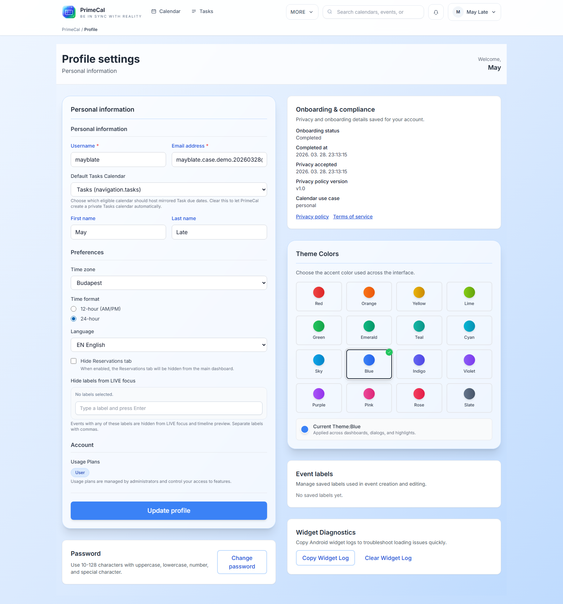

# Page de profil {#profile-page}

La page Profil est le centre de contrôle de l'identité, de la localisation, de l'apparence, des étiquettes et du comportement Focus de votre compte.

## Comment l'ouvrir {#how-to-open-it}

1. Ouvrez l'espace de travail principal.
2. Ouvrez votre menu utilisateur.
3. Sélectionnez `Profile`.

## Principales zones de la page {#main-areas-on-the-page}

| Zone | Ce que vous contrôlez | Pourquoi c'est important |
| --- | --- | --- |
| Identité | Nom d'utilisateur, email, prénom, nom, image de profil | Ces détails façonnent votre apparence dans PrimeCal. |
| Paramètres régionaux | Langue, fuseau horaire, format de l'heure, début de semaine | Ces paramètres influencent chaque date de calendrier et de tâche que vous lisez. |
| Paramètres par défaut du calendrier | Calendrier des tâches par défaut et préférences de visibilité | Utile lorsque vous travaillez avec plusieurs calendriers à la fois. |
| Libellés d'événements | Balises d'événement réutilisables | Rend plus rapide la classification des événements et la création de filtres Focus. |
| Paramètres de mise au point | Étiquettes de mise au point en direct masquées et comportement sans mise au point | Vous aide à désactiver la vue Focus en direct sans masquer les mêmes éléments partout ailleurs. |
| Sécurité | Changement de mot de passe | Garde l'accès au compte sous votre contrôle. |
| Apparence | Couleur du thème et préférences visuelles | Maintient l’espace de travail lisible et cohérent. |

## Paramètres spécifiques à la mise au point {#focus-specific-settings}

L'option Focus la plus importante est la liste des étiquettes masquées dans la vue Focus en direct.

- Les événements portant ces étiquettes restent sur le calendrier.
- Ils apparaissent toujours dans la vue Mois et Semaine, sauf si vous masquez leur calendrier.
- Le filtre est utile pour les éléments d'arrière-plan tels que les courses, le travail administratif ou les rappels passifs.

## Bonnes habitudes de profil {#good-profile-habits}

- Définissez le fuseau horaire avant de créer des événements importants.
- Gardez les étiquettes d’événements courtes et réutilisables afin qu’elles restent faciles à filtrer.
- Utilisez les étiquettes Focus masquées avec parcimonie. Trop de filtres peuvent rendre l'affichage en direct déroutant.
- Vérifiez à nouveau votre profil après avoir créé quelques calendriers et routines.

## Pages connexes {#related-pages}

- [Mode de mise au point et mise au point en direct](../basics/focus-mode-and-live-focus.md)
- [Espace de travail du calendrier](../calendars/calendar-workspace.md)
- [Journaux personnels](../privacy/personal-logs.md)

## Référence du développeur {#developer-reference}

Pour les contrats de profil backend, utilisez le [Utilisateur API](../../DEVELOPER-GUIDE/api-reference/user-api.md).
