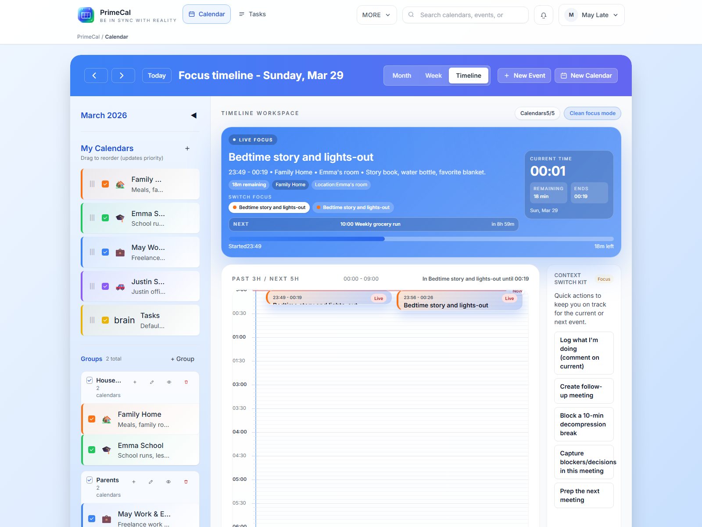

# Mindennapi tervezés GYIK {#everyday-planning-faq}

Ezen az oldalon találhatja meg azokat a kérdéseket, amelyeket a felhasználók rendszerint feltesznek a regisztráció után: hogyan lehet gyorsan kezdeni, hogyan kell felépíteni a naptárakat, miért viselkednek eltérően a nézetek, és hol találhatók a fő termékterületek.

## most jelentkeztem. Mit tegyek az első 10 percben? {#i-just-signed-up-what-should-i-do-in-the-first-10-minutes}

**Rövid válasz:** fejezze be a csatlakozást, hozza létre első valódi naptárát, hozzon létre egy csoportot, ha már tudja, hogy egynél több naptárra van szüksége, majd adjon hozzá egy valós eseményt.

Ajánlott rendelés:

1. Fejezze be a regisztrációt és a belépés folyamatát.
2. Hozzon létre egy naptárat, amelyet azonnal használni fog.
3. Csak akkor adjon hozzá második vagy harmadik naptárat, ha már ismeri az elválasztást.
4. Hozzon létre egy eseményt, és ellenőrizze, hogy jól néz ki a hónap vagy a hét nézetben.
5. Csak ezután lépjen át a Feladatok, az Automatizálás vagy a szinkronizálás területére.

A teljes áttekintéshez használja a [Gyors üzembe helyezési útmutatót](../GETTING-STARTED/quick-start-guide.md) és a [Kezdő beállítást](../GETTING-STARTED/first-steps/initial-setup.md).

## Családi életet tervezek. Egy vagy több naptárt hozzak létre? {#i-am-planning-family-life-should-i-create-one-calendar-or-several}

**Rövid válasz:** hozzon létre külön naptárakat, ha a láthatóság, a tulajdonjog vagy a szín jelentése számít.

A valósághű családbeállítás általában világosabb több naptárral, például:

- `Family` megosztott találkozókhoz és logisztikához
- `School` az átvételhez, a tevékenységekhez és a szülői határidőkhöz
- `Home` házimunkákhoz, szállításokhoz és karbantartáshoz
- `Personal` egy személy találkozóira és védett idejére

Használjon egyetlen naptárat, ha minden esemény azonos láthatósági és színlogikát követ. Oszd fel több részre, ha tisztább szűrőket, tisztább színeket vagy könnyebb elrejtést szeretnél.

## Mi a különbség a naptár és a naptárcsoport között? {#what-is-the-difference-between-a-calendar-and-a-calendar-group}

**Rövid válasz:** a naptár eseményeket tartalmaz; egy naptárcsoport csak az oldalsávon rendezi a naptárakat.

Használjon naptárat, ha maguknak az eseményeknek saját színre, megosztásra vagy láthatóságra van szükségük. Használjon csoportot, ha a naptárak már léteznek, és tisztább bal oldali szerkezetet szeretne, például `Family`, `School` vagy `Work`.

## Egyelőre el akarok rejteni egy naptárat törlés nélkül. Hogyan? {#i-want-to-hide-a-calendar-for-now-without-deleting-it-how}

**Rövid válasz:** törlés helyett kapcsolja be a láthatóságát az oldalsávon.

Ha elrejt egy naptárt:

- eseményei eltűnnek a Fókuszból, a Hónapból és a Hétből
- a naptár és eseményei nem törlődnek
- később újra megmutathatja anélkül, hogy bármit is újraépítene

Ha csak a Fókusz nézetet szeretné leegyszerűsíteni, először ne rejtse el az egész naptárt. Kezdje inkább a Fókusz-specifikus címkeszűrőkkel.

## Miért számítanak annyira a színek a PrimeCal-ban? {#why-do-colors-matter-so-much-in-primecal}

**Rövid válasz:** a szín a leggyorsabb módja annak, hogy felismerje a tulajdonjogot és a kontextust a zsúfolt nézetekben.

A PrimeCal a naptárszínt használja alapértelmezett vizuális jelként a hónapban és a héten. Ezért érdemes valódi jelentéssel bíró színeket választani, mint pl.

- kék a családi logisztikához
- zöld iskola vagy gyerekek számára
- narancssárga otthoni műveletekhez
- piros vagy korall sürgős személyes találkozókhoz

Ha a színnek nincs jelentése, a Hónap és a Hét beolvasása nehezebb lesz.

## Miért mutat kevesebbet a Focus, mint a hónap vagy a hét? {#why-does-focus-show-less-than-month-or-week}

**Rövid válasz:** A fókusz szándékosan szelektív, míg a Hónap és a Hét tágabb tervezési nézet.

A Fókusz két különböző okból rejtheti el az elemeket:

- maga a naptár el van rejtve
- az esemény olyan címkét használ, amelyet rejtettként konfigurált az élő fókuszban

Ez normális. A Focus állítólag csökkenti a zajt az aktuális pillanatban, míg a hónap és a hét közelebb marad a teljes ütemtervhez.

## Csak iskolai átvételt és találkozókat szeretnék Fókusz nézetben. Hogyan rejthetem el a házimunkát anélkül, hogy törölném őket? {#i-only-want-school-pickups-and-appointments-in-focus-view-how-do-i-hide-chores-without-deleting-them}

**Rövid válasz:** használja a `Profile` és konfigurálja a `Hide labels from LIVE focus`.

Ez a megfelelő eszköz, ha azt szeretné, hogy a házimunka-stílusú elemek láthatóak maradjanak a hónapban vagy a héten, de ne uralják az élő Fókusz felületet. Gyakori minta az olyan címkék elrejtése, mint a `routine`, `household` vagy `no-focus`.

A teljes viselkedés érdekében használja a [Fókusz mód és Élő fókusz](../USER-GUIDE/basics/focus-mode-and-live-focus.md) funkciót.

## Hová tűntek a feladatok, az automatizálás, a külső szinkronizálás, az AI-ügynökök és a személyes naplók? {#where-did-tasks-automation-external-sync-ai-agents-and-personal-logs-go}

**Rövid válasz:** A speciális funkciókat a `More` tartalmazza.

A PrimeCal láthatóvá teszi a napi tervezési felületeket, és egy előre látható helyen csoportosítja a fejlett eszközöket, így a munkaterület tiszta marad. A `More` segítségével keresse meg:

- `Automation`
- `External Sync`
- `AI Agents (MCP)`
- `Personal logs`

## Mit olvassak ezután, ha a teljes magyarázatot szeretném a rövid válasz helyett? {#what-should-i-read-next-if-i-want-the-full-explanation-instead-of-the-short-answer}

- [Fiók létrehozása](../GETTING-STARTED/first-steps/creating-your-account.md)
- [Naptár munkaterület](../USER-GUIDE/calendars/calendar-workspace.md)
- [Naptárnézetek](../USER-GUIDE/basics/calendar-views.md)
- [Fókusz mód és élő fókusz](../USER-GUIDE/basics/focus-mode-and-live-focus.md)
