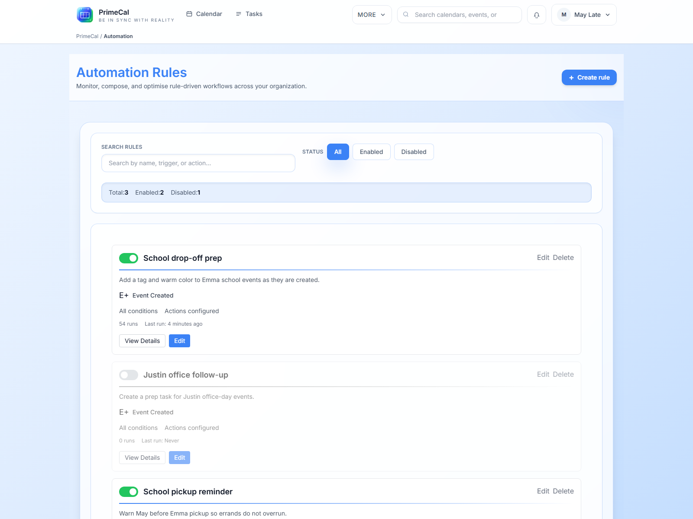

# Automatizálás, szinkronizálás és mesterséges intelligencia ügynökök GYIK {#automation-sync-and-ai-agents-faq}

Ezek a hatékony felhasználók kérdései. Használja ezt az oldalt, ha eldönti, hogy a PrimeCal automatikusan végezze-e el a munkát, szinkronizálja-e máshonnan, vagy hagyja, hogy egy mesterséges intelligencia ügynök járjon el az Ön nevében.

## Ezt automatizálással vagy mesterséges intelligencia ügynökkel oldjam meg? {#should-i-solve-this-with-automation-or-with-an-ai-agent}

**Rövid válasz:** használja az automatizálást az ismételhető terméken belüli szabályokhoz; AI ügynököt használjon, ha egy külső eszköznek ellenőrzött hozzáférésre van szüksége a PrimeCal-hoz.

Válassza a `Automation` lehetőséget, ha:

- a kiváltó ok megjósolható
- a szabálynak minden alkalommal ugyanúgy kell futnia
- a logika természetesen él PrimeCal

Válassza a `AI Agents (MCP)` lehetőséget, ha:

- külső kódolóeszköznek vagy asszisztensnek hozzáférésre van szüksége
- az engedélyeket a szolgáltatások vagy naptárak szerint kell szigorúan behatárolni
- a PrimeCal-on kívüli ember vagy szerszám kezdeményezi a munkát

## Az importált események kiválthatnak automatizálást? {#can-imported-events-trigger-automations}

**Rövid válasz:** igen, az importált események részt vehetnek az automatizálásban, ha beállítja a szabályt az adott munkafolyamathoz.

Ez erős kombinációt alkot az olyan esetekben, mint:

- importált iskolai naptárak átszínezése
- nyomon követési feladatok létrehozása az importált eseményekből
- címek vagy leírások normalizálása szinkronizálás után

Kezdje kicsiben, és ellenőrizze egy valós példát, mielőtt nagyobb szabálykészletet építene.

## Csatlakoztam a Google-hoz vagy a Microsofthoz. Mit kell szinkronizálnom először? {#i-connected-google-or-microsoft-what-should-i-sync-first}

**Rövid válasz:** Kezdje egy vagy két naptárral, amelyre valóban szüksége van, ne a teljes fiókjával.

A legbiztonságosabb első kapcsolat egy kicsi, értelmes készlet, mint például:

- egy közös családi naptár
- egy iskolai vagy munkahelyi naptár

Ez megkönnyíti az elnevezési, színezési, másolási és ismétlődési problémák észlelését, mielőtt a beállítás szélesebbé válna.

## A szinkronizált naptár duplikáltnak vagy rendetlennek tűnik. Mi a legbiztonságosabb megoldás? {#a-synced-calendar-looks-duplicated-or-messy-what-is-the-safest-fix}

**Rövid válasz:** először egyszerűsítsen, majd ha szükséges, csatlakoztassa újra.

Dolgozzon ebben a sorrendben:

1. ellenőrizze, hogy mely naptárak vannak ténylegesen leképezve
2. csökkentse a kapcsolatot a legkisebb hasznos halmazra
3. ellenőrizze újra, hogy a kétirányú viselkedés megfelelő-e
4. ha a leképezés hibás, húzza ki a kapcsolatot, majd csatlakoztassa újra, ahelyett, hogy több változtatást halmozna fel

## Az AI-ügynök alapértelmezés szerint elolvashatja a teljes fiókomat? {#can-an-ai-agent-read-my-whole-account-by-default}

**Rövid válasz:** nem. A PrimeCal ügynökök jogosultságokkal és hatókörrel rendelkeznek.

A legbiztonságosabb módszer a következők megadása:

- csak azokat a műveleteket, amelyekre az eszköznek szüksége van
- csak azokat a naptárakat vagy automatizálási szabályokat, amelyekre szüksége van
- csak egy kulcs eszközönként vagy munkafolyamatonként

## Mi a legbiztonságosabb első teszt az ügynök létrehozása után? {#what-is-the-safest-first-test-after-creating-an-agent}

**Rövid válasz:** teszteljen egy alacsony kockázatú olvasást vagy egy alacsony kockázatú írást egy nem kritikus naptárral.

Jó példák:

- listázza az eseményeket egy tesztnaptárból
- hozzon létre egy tesztfeladatot
- egy roncsolásmentes automatizálási szabályt indít el

Ne kezdjen széles írási hatókörrel vagy gyártáskritikus naptárral.

## Szükségem van szerszámonként egy ügynökre? {#do-i-need-one-agent-per-tool}

**Rövid válasz:** igen, a legtöbb esetben ez a tisztább és biztonságosabb minta.

A különálló ügynökök megkönnyítik:

- megérteni, kihez vagy mihez tartozik a kulcs
- visszavonni egy ügyfelet anélkül, hogy ez másokat érintene
- pontosan szűkítse az engedélyeket

## Kombinálhatom a szinkronizálást, az automatizálást és az AI-ügynököket? {#can-i-combine-sync-automation-and-ai-agents}

**Rövid válasz:** igen, de rétegezze őket a stabilitás sorrendjében.

Bevált gyakorlat bevezetése:

1. hogy a külső szinkronizálás eredménye helyes legyen
2. adjunk hozzá egy automatizálási szabályt
3. AI ügynököt csak akkor adjon hozzá, ha megértette a stabil adatalakot

## Merre menjek tovább? {#where-should-i-go-next}

- [Bevezetés az automatizálásba](../USER-GUIDE/automation/introduction-to-automation.md)
- [Automatizálások kezelése és futtatása](../USER-GUIDE/automation/managing-and-running-automations.md)
- [Külső szinkronizálás](../USER-GUIDE/integrations/external-sync.md)
- [Az ügynök konfigurációja](../USER-GUIDE/agents/agent-configuration.md)
