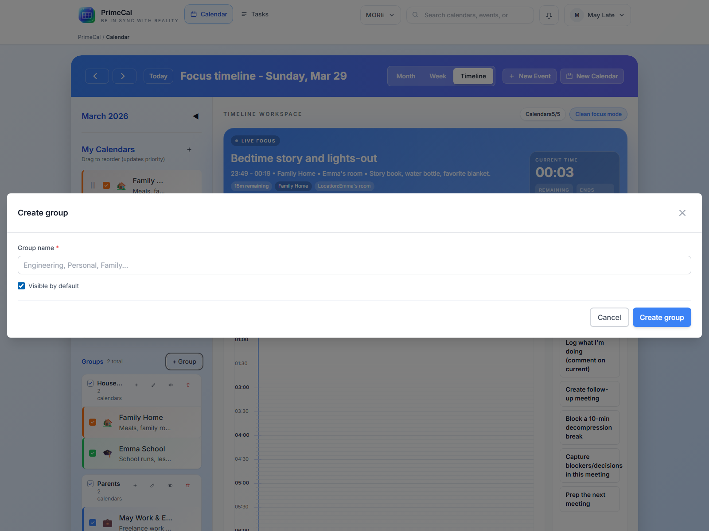

# Kezdeti beállítás {#initial-setup}

A PrimeCal a belépés után azonnal használható, de a legjobb első lépés egy normál naptár létrehozása, és az oldalsáv a tényleges munkamódszernek megfelelő rendszerezése.

## Hozzon létre egy új naptárt {#create-a-new-calendar}

### Hol kell kattintani {#where-to-click}

1. Nyissa meg a `Calendar`.
2. A naptár oldalsávján kattintson a `New Calendar` elemre.
3. Töltse ki a párbeszédpanelt.
4. Mentse el a naptárt.

### Naptár mezők {#calendar-fields}

| Mező | Kötelező | Mit csinál | Szabályok és korlátok |
| --- | --- | --- | --- |
| Név | Igen | A naptár fő neve | Legyen rövid és világos. Ezt fogja látni az oldalsávon és az eseményűrlapokon. |
| Leírás | Nem | Extra kontextus | Választható segédszöveg a naptárhoz. |
| Szín | Igen | Vizuális identitás | Használjon külön színt, mert ez a szín irányítja az események megjelenítését a nézetekben, hacsak egy esemény nem írja felül azt. |
| Ikonra | Nem | Sidebar dákó | Opcionális vizuális jelölő az oldalsávhoz és a kapcsolódó eseményfelületekhez. |
| Csoport | Nem | Rendszerezd együtt a naptárakat | Rendelje hozzá a naptárt egy meglévő csoporthoz, vagy hagyja csoportosítás nélkül. |

### Jó első naptárakat {#good-first-calendars}

- `Family`
- `Personal`
- `Work`
- `School`

## Naptár csoportok {#calendar-groups}

A csoportok segítenek, ha több naptár van az oldalsávban. Nem helyettesítik a naptárakat. Egyszerűen megszervezik őket.

### Hozzon létre egy csoportot {#create-a-group}

A naptárterületről csoportot hozhat létre, amikor szüksége van rá.

- Kattintson a csoportlétrehozási műveletre az oldalsávon vagy a soron belüli csoport lehetőségre a naptár párbeszédpanelen.
- Írjon be egy egyértelmű nevet, például `Family`, `Work` vagy `Shared`.
- Mentse el a csoportot.

### A csoport átnevezése {#rename-a-group}

- Nyissa meg a csoportműveleteket.
- Válassza az átnevezést.
- Mentse el az új nevet.

### Naptárak hozzárendelése vagy hozzárendelésének visszavonása {#assign-or-unassign-calendars}

- Nyissa meg a csoport-hozzárendelés vezérlőjét.
- Válassza ki a csoporthoz tartozó naptárakat.
- Mentse el a változtatásokat.

A naptárak később törlés nélkül is eltávolíthatók egy csoportból.

### Csoport elrejtése vagy megjelenítése {#hide-or-show-a-group}

Használja a csoport láthatósági vezérlőjét, ha egyszerre el szeretné rejteni vagy felfedni a teljes készletet. Ez a leggyorsabb módja a munkaterület lecsillapításának.

### A csoport törlése {#delete-a-group}

Egy csoport törlése a tárolót távolítja el, nem a benne lévő naptárakat. A naptárak továbbra is elérhetők csoportosítatlan naptárakként.

## Hogyan befolyásolják a színek és a láthatóság a kilátást {#how-colors-and-visibility-affect-the-views}

- A naptár színe megjelenik az oldalsávban, és az esemény alapértelmezett színe lesz.
- A rejtett naptárak eltűnnek a fókusz, a hónap és a hét nézetből.
- A csoport láthatósága a csoporton belüli összes naptárt érinti, amíg újra meg nem jeleníti.
- Az eseményszintű színek továbbra is felülírhatják egy adott esemény naptárszínét.

## Legjobb gyakorlatok {#best-practices}

- Hozzon létre egy vagy két valódi naptárat, mielőtt sok eseményt összeállítana.
- Csak akkor használjon csoportokat, ha azok segítik a szkennelést. Valós területenként általában elég egy csoport.
- Válasszon olyan színeket, amelyek egy pillantásra vizuálisan megkülönböztethetők.
- Tartsa meg az alapértelmezett `Tasks` naptárat a feladatokhoz. Használjon rendszeres naptárakat találkozókhoz, iskolához, utazáshoz és családtervezéshez.

## Fejlesztői referencia {#developer-reference}

Ha naptár- vagy csoportkezelést valósít meg, használja a [Calendar API](../../DEVELOPER-GUIDE/api-reference/calendar-api.md) elemet.
