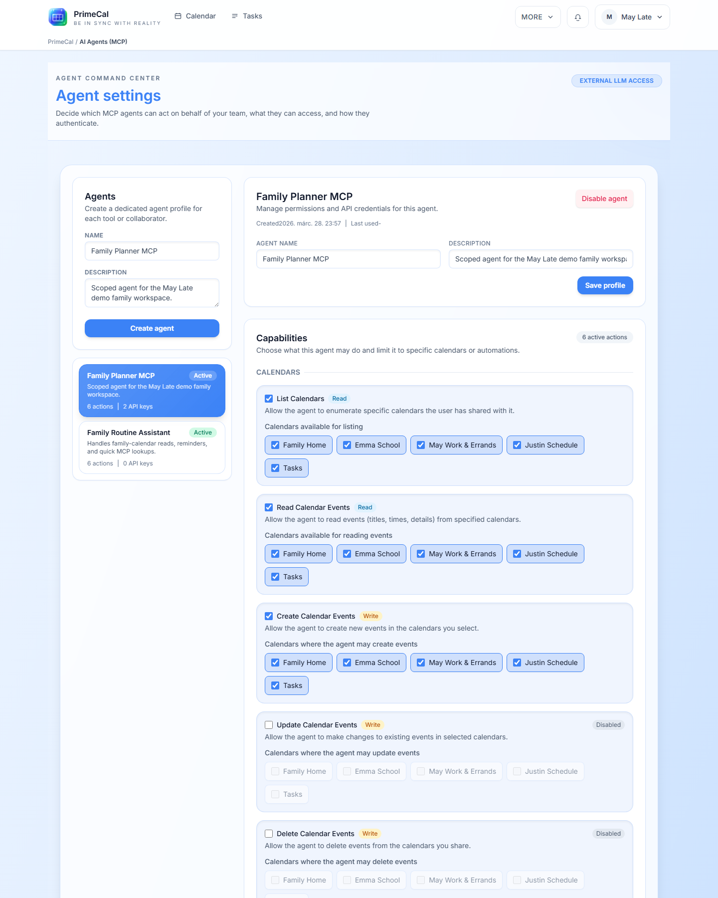
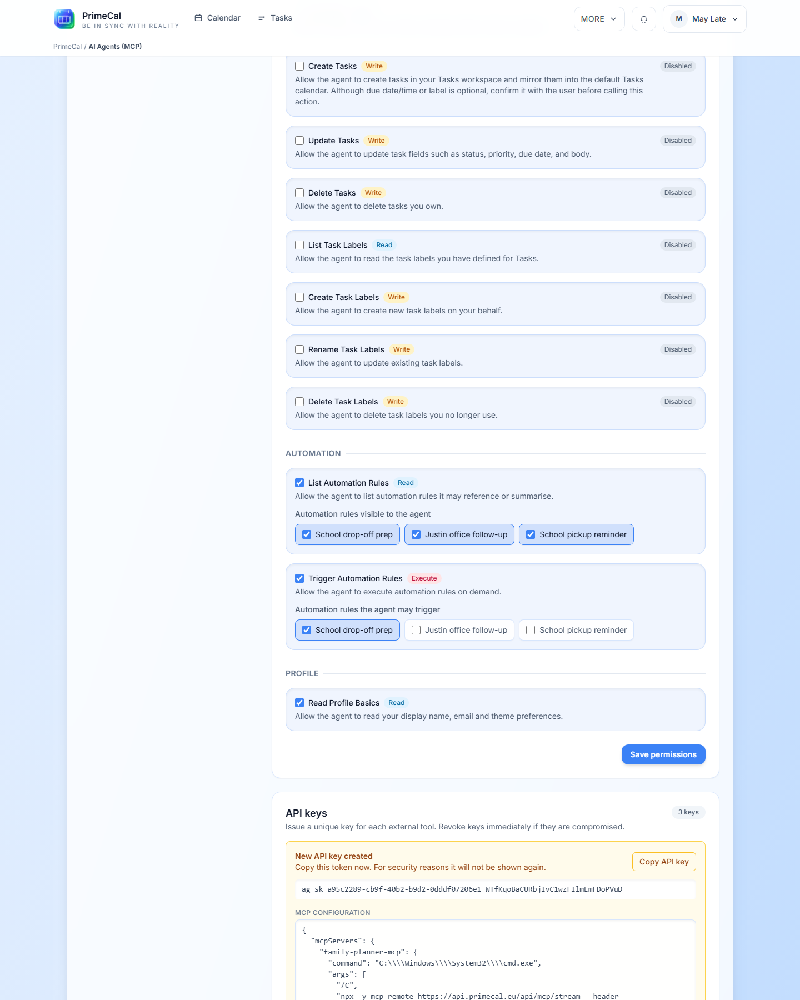

# Ügynök konfigurációja {#agent-configuration}

A PrimeCal külön `AI Agents (MCP)` képernyőt tartalmaz azon felhasználók számára, akik külső eszközöket szeretnének csatlakoztatni anélkül, hogy korlátlan hozzáférést biztosítanának a fiókhoz.

## Hogyan lehet megnyitni {#how-to-open-it}

1. Nyissa meg a `More`.
2. Válassza a `AI Agents (MCP)` lehetőséget.
3. Hozzon létre vagy válasszon ügynököt.

## Mit lehet konfigurálni {#what-you-can-configure}

  <article class="pc-guide-card">
    
Identitás

    <h3>Név és leírás</h3>
    
Hozzon létre egy ügynökrekordot egyértelmű névvel, hogy később tudja, melyik eszközhöz tartozik.

  </article>
  <article class="pc-guide-card">
    
Engedélyek

    <h3>Hatáskör jellemzők szerint</h3>
    
Csak azokat a műveleteket engedélyezze, amelyekre az ügynöknek szüksége van, és szükség esetén érvényesítse ezeket az engedélyeket a kiválasztott naptárra vagy szabályokra.

  </article>
  <article class="pc-guide-card">
    
Kulcsok

    <h3>Kiadás és visszavonás</h3>
    
Hozzon létre egy kulcsot, másolja ki egyszer, majd vonja vissza később, ha a kliens nem csatlakozik többé.

  </article>
  <article class="pc-guide-card">
    
MCP

    <h3>Létrehozott konfiguráció</h3>
    A 
PrimeCal előállítja a MCP konfigurációt, így nem kell manuálisan összeállítania.

  </article>

## Ajánlott beállítási folyamat {#recommended-setup-flow}

1. Hozd létre az ügynököt.
2. Csak azokat az engedélyeket adja hozzá, amelyekre valóban szüksége van.
3. Adjon ki egy új kulcsot.
4. Másolja a generált konfigurációt a képernyőről.
5. Illessze be ezt a konfigurációt a MCP ügyfélprogramjába.
6. Először tesztelje alacsony kockázatú művelettel.

A titok egyszer megjelenik a kulcs létrehozásakor. Ha elveszíti, vonja vissza a kulcsot, és hozzon létre egy újat.

## Képernyők, amelyeket használni fog {#screens-you-will-use}

## Legjobb gyakorlatok {#best-practices}

- Hozzon létre külön ügynököt minden külső eszközhöz vagy munkafolyamathoz.
- Egyetlen univerzális ügynök létrehozása helyett tartsa szűk az engedélyeket.
- Nevezze el a kulcsokat, hogy felismerje őket az ellenőrzés vagy a tisztítás során.
- Forgassa el vagy vonja vissza a kulcsokat, amikor egy eszköz már nincs használatban.

## Fejlesztői referencia {#developer-reference}

Ha szüksége van a képernyő mögötti háttérszerződésekre, használja a [API](../../DEVELOPER-GUIDE/api-reference/agent-api.md) ügynököt.
