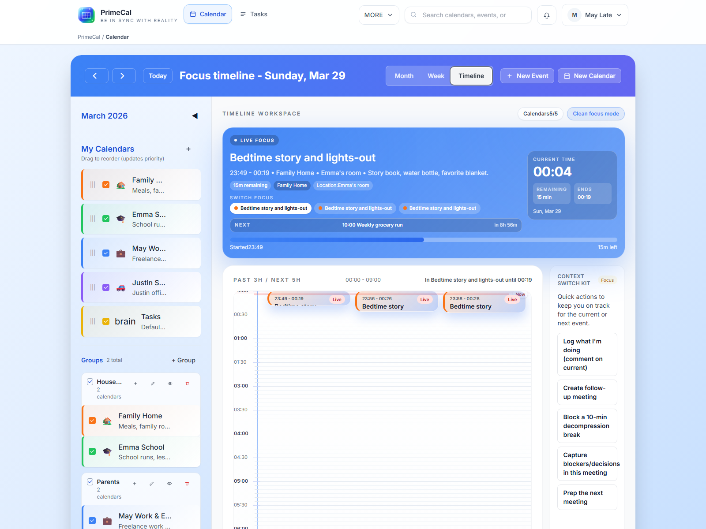
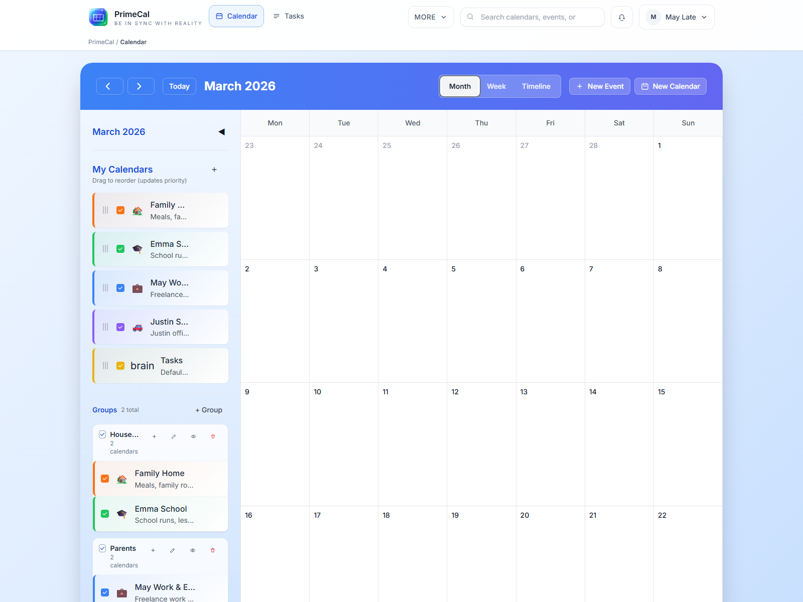
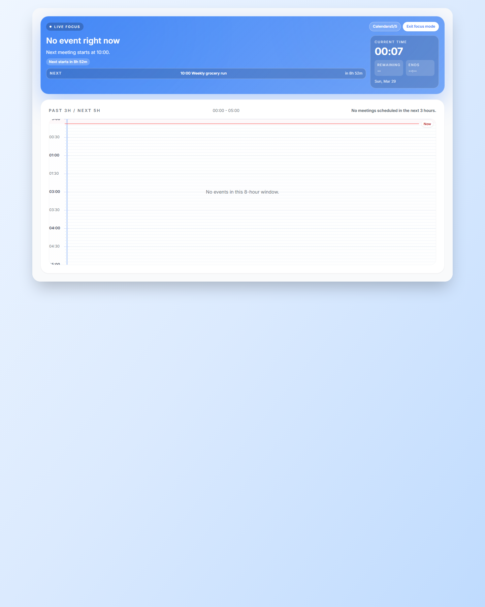

# Naptárnézetek {#calendar-views}

A PrimeCal ugyanazokat az eseményadatokat jeleníti meg három elsődleges ütemezési nézetben: Fókusz, Hónap és Hét. Mindegyik nézet más-más döntést hangsúlyoz.

## Gyors összehasonlítás {#quick-comparison}

| Megtekintés | A legjobb | Kulcsviselkedés |
| --- | --- | --- |
| Fókusz nézet | Jelenlegi munka és a következő esemény | Megjeleníti az aktuális idővonal állapotát, a következő elemet, a hátralévő időt és a gyors értekezleti műveleteket. |
| Havi nézet | Több napos tervezés | Hat hetes rácsot, kompakt eseménykártyákat és egy kiválasztott napos részletes panelt jelenít meg. |
| Heti nézet | Részletes ütemezés | 24 órás rácsot, átfedő elrendezést, húzással létrehozhat és pontos időbeli elhelyezést jelenít meg. |

## Fókusz nézet {#focus-view}

- Jól láthatóan mutatja az aktuális és a következő eseményt.
- Tartalmaz egy élő órát és a hátralévő idő jelzőjét.
- Támogatja a húzással történő létrehozást az idővonalon.
- Megjeleníti a találkozó hivatkozásait, ha az esemény tartalmazza azokat.
- Tiszteletben tartja a rejtett élő Focus címkéket a profiloldalon.

## Havi nézet {#month-view}

- Hat hetes rács elrendezést mutat.
- Naptár- és eseményszíneket használ a kompakt kártyákon.
- A napi felületek száma korlátozott hely esetén számít.
- A kiválasztott nap részletes paneljét jeleníti meg az asztalon.
- Megjelenítheti a foglalással kapcsolatos elemeket, ahol ezek a funkciók engedélyezve vannak.

## Heti nézet {#week-view}

- 24 órás függőleges időrácsot használ.
- Támogatja a húzással történő kiválasztást egy előre kitöltött esemény létrehozásához.
- Az egymást átfedő eseményeket naptári rang, majd naptárazonosító, majd eseményazonosító szerint rendezi.
- A pontos időt mutatja a nap folyamán.
- Valódi helyeket térképhivatkozásokká alakíthat.

## Láthatósági és színszabályok {#visibility-and-color-rules}

- Ha elrejti a naptárt az oldalsávról, az eltávolítja a Fókusz, a Hónap és a Heti nézetből.
- A címkék elrejtése a profiloldalon csak a Fókusz nézetet érinti.
- A naptárszínek az alapértelmezett vizuális források minden nézetben.
- Az eseményszintű színek felülírják az adott esemény naptárszínét.

## Példák élő nézetre {#live-view-examples}

