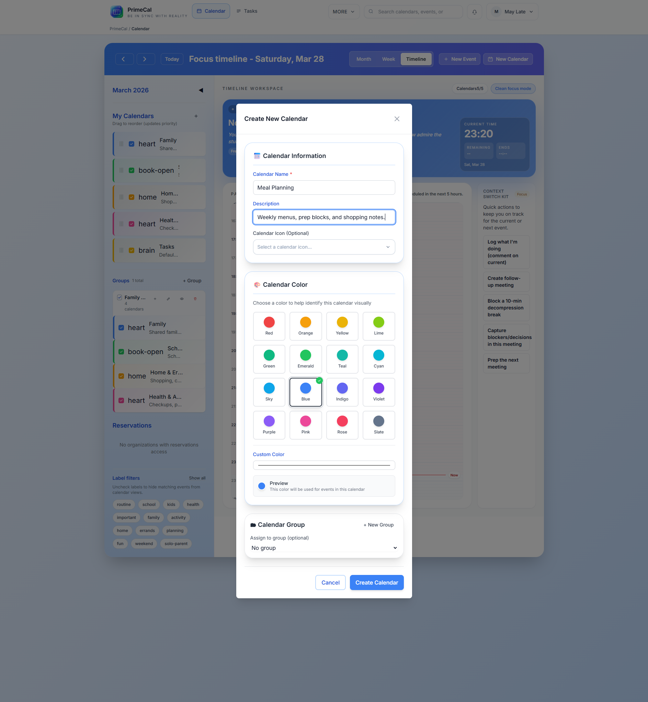

# Naptár munkaterület {#calendar-workspace}

A Naptár munkaterületen kezdődik a napi tervezés. Itt hozhat létre naptárakat, csoportosíthatja őket, választhat színeket, és eldöntheti, hogy mi maradjon látható az egyes nézetekben.

## Hol kell kattintani {#where-to-click}

- Asztali: nyissa meg a `Calendar` fájlt, majd használja a `New Calendar` elemet a fejlécben vagy az oldalsáv műveletében.
- Mobil vagy szűk elrendezések: nyissa meg a `Calendar`, bontsa ki a fiókot, majd használja a naptárterület létrehozása műveletét.

## Hozzon létre egy új naptárt {#create-a-new-calendar}

### Naptár mezők {#calendar-fields}

| Mező | Kötelező | Cél | Megjegyzések |
| --- | --- | --- | --- |
| Név | Igen | Fő naptárcímke | Használjon rövid nevet, például `Family`, `Work` vagy `School`. |
| Leírás | Nem | Extra kontextus | Hasznos, ha a naptárnak szűk célja van. |
| Szín | Igen | Vizuális identitás | A naptárszín lesz az alapértelmezett eseményszín a nézetekben. |
| Ikonra | Nem | Sidebar dákó | Választható. Hasznos, ha több naptárnak hasonló a neve. |
| Csoport | Nem | Rendszerezze az oldalsávot | Rendelje hozzá a naptárt egy meglévő csoporthoz, ha már rendelkezik ilyennel. |

## Napi cselekvések {#day-to-day-actions}

- Naptár megjelenítése vagy elrejtése az oldalsávon.
- Nevezzen át egy naptárt, ha a célja megváltozik.
- Módosítsa a naptár színét, ha túl közel van egy másik naptárhoz.
- Rendelje hozzá a naptárat egy másik csoporthoz.
- Törölje a naptárt, ha már nincs rá szüksége.

## Csoportok és láthatóság {#groups-and-visibility}

A csoportok teljes leírása a [Calendar Groups](./calendar-groups.md) oldalon található, de a munkaterületen érzi a legtisztábban a hatásukat.

- A naptár elrejtésével eltávolítja azt a fókusz, a hónap és a hét nézetből.
- Egy egész csoport elrejtése minden benne lévő naptár esetében ugyanezt teszi.
- A csoportosítatlan naptárak egyedi sorokként maradnak láthatók.

## Hogyan hatnak a színek a kilátásokra {#how-colors-affect-the-views}

- A havi nézet a naptár színét használja a kompakt eseményblokkokhoz.
- A heti nézet a naptár színét használja, kivéve, ha az eseménynek saját felülírása van.
- A Fókusz nézet ugyanazt a színforrást használja, amikor az aktuális és a következő esemény felszínére kerül.

Ez az oka annak, hogy az egységes színek fontosabbak, mint a dekoratív változatosság.

## Legjobb gyakorlatok {#best-practices}

- Minden naptárat az élet egy valós területéhez kössön, ne egy egyedi projektet.
- Használjon csoportokat olyan stabil területekhez, mint a `Family`, `Work` vagy `Shared`.
- Kerülje a túlságosan hasonló színeket, amikor az események átfedésben vannak a heti nézetben.
- Tekintse át a láthatóságot, mielőtt feltételezi, hogy egy esemény hiányzik.

## Fejlesztői referencia {#developer-reference}

A háttérnaptárhoz és a csoportszerződésekhez használja a [Calendar API](../../DEVELOPER-GUIDE/api-reference/calendar-api.md) elemet.
