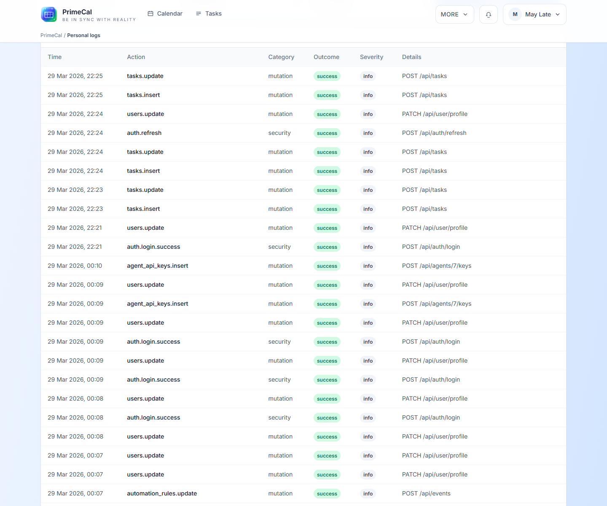

# Személyes naplók {#personal-logs}

A Személyes naplók az Ön privát tevékenységei és adatvédelmi képernyője. Segít megérteni, mi történt a fiókjában, anélkül, hogy a rendszerszintű adminisztrátori adatokat felfedné.

## Hogyan lehet megnyitni {#how-to-open-it}

1. Nyissa meg a `More`.
2. Válassza a `Personal logs` lehetőséget.

## Amit áttekinthetsz {#what-you-can-review}

| szakasz | Mit mutat |
| --- | --- |
| Összefoglaló kártyák | Gyors kép a legutóbbi tevékenységekről és a fiók viselkedéséről |
| Adatvédelmi intézkedések | Személyes exportálás vagy adatvédelemmel kapcsolatos műveletek érhetők el fiókjában |
| Tevékenység hírcsatorna | Részletes feljegyzések időbélyegekkel és eredményekkel |
| Szűrők | Szűkítse a listát, hogy gyorsabban találhasson konkrét műveleteket |

## Tevékenység táblázat {#activity-table}

A tevékenység táblázat akkor hasznos, ha olyan kérdésekre szeretne válaszolni, mint például:

- Mi változott mostanában?
- Sikertelen vagy sikertelen volt a bejelentkezés?
- Mikor kértek adatvédelmi intézkedést?
- Az automatizálással kapcsolatos tevékenységek érintették a fiókomat?

## Legjobb gyakorlatok {#best-practices}

- Használja ezt az oldalt privát felülvizsgálati eszközként, nem pedig megosztott ellenőrzési irányítópultként.
- Szokatlan bejelentkezési viselkedés vagy adatvédelmi változások után ellenőrizze.
- Tartsa a profilbeállításokat és az adatvédelmi beállításokat az itt látottakhoz igazítva.
- Ha csak a beállításokat kell módosítania, térjen vissza a [Profiloldalra](../profile/profile-page.md).

## Fejlesztői referencia {#developer-reference}

A képernyő mögötti, felhasználó tulajdonában lévő ellenőrzési útvonalakhoz használja a [Személyes naplókat API](../../DEVELOPER-GUIDE/api-reference/personal-logs-api.md).
