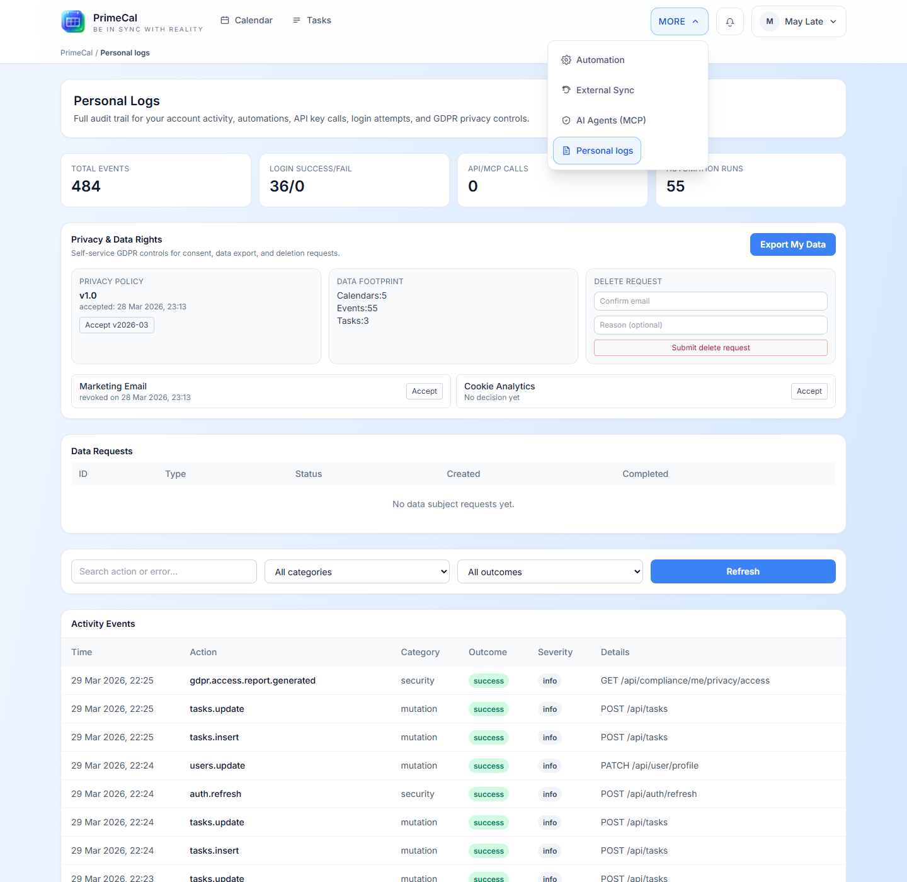

  
PrimeCal Docs

  <h1 class="pc-guide-hero__title">Tiszta útvonal az első bejelentkezéstől a speciális munkafolyamatokig</h1>
  
Kezdje a regisztrációval és a beállítással, lépjen tovább a mindennapi PrimeCal munkaterületre, majd térjen át az automatizálásra, a külső szinkronizálásra, az AI-ügynökökre és a teljes fejlesztői hivatkozásra.

  

    Valódi termék képernyőképek
    PrimeCal színrendszer
    Felhasználói struktúra
    Kóddal támogatott API dokumentumok
  

## Kezdje itt {#start-here}

  <article class="pc-guide-card pc-guide-card--accent">
    
Kezdje el most

    <h3><a href="/GETTING-STARTED">Kezdő lépések</a></h3>
    
Regisztráljon, fejezze be a regisztrációt, hozza létre az első valódi naptárat, szervezzen csoportokat, és adja hozzá az első eseményt.

  </article>
  <article class="pc-guide-card">
    
Napi munka

    <h3><a href="/USER-GUIDE">Felhasználói dokumentáció</a></h3>
    
Profilbeállítások, naptárnézetek, feladatok, automatizálás, szinkronizálás, AI-ügynökök és személyes naplók.

  </article>
  <article class="pc-guide-card pc-guide-card--indigo">
    
Integrálás

    <h3><a href="/DEVELOPER-GUIDE">Fejlesztői dokumentáció</a></h3>
    
Swagger-stílusú dokumentáció minden nem rendszergazdai háttérterülethez, ugyanazon termékfunkciók szerint csoportosítva, amelyeket a felhasználók látnak.

  </article>
  <article class="pc-guide-card">
    
Gyors válaszra van szüksége

    <h3><a href="/FAQ">FAQ</a></h3>

Rövid, valós válaszok a beállításhoz, nézetekhez, szinkronizáláshoz, automatizáláshoz, mesterséges intelligencia-ügynökökhöz, adatvédelemhez és hibaelhárításhoz.

  </article>

## PrimeCal Jellemzők {#primecal-features}

  <article class="pc-guide-card">
    
Tervezés

    <h3><a href="/USER-GUIDE/calendars/calendar-workspace">Calendar</a></h3>
    
Hozzon létre naptárakat, csoportosítsa őket, szabályozza a színeket és a láthatóságot, majd váltson a Fókusz, a Havi és a Heti nézet között.

  </article>
  <article class="pc-guide-card">
    
Végrehajtás

    <h3><a href="/USER-GUIDE/tasks/tasks-workspace">Tasks</a></h3>
    
Rögzítsen gyors feladatokat, kezelje a címkéket, és dolgozzon át egy élő listát, amely közel marad a naptári rutinjához.

  </article>
  <article class="pc-guide-card pc-guide-card--signal">
    
Kiemelt

    <h3><a href="/USER-GUIDE/automation/introduction-to-automation">Automatizálás</a></h3>
    
Készítsen szabályokat triggerekkel, feltételekkel és műveletekkel, hogy az ismétlődő naptári munka automatikusan lefusson.

  </article>
  <article class="pc-guide-card">
    
Kapcsolatok

    <h3><a href="/USER-GUIDE/integrations/external-sync">Külső szinkronizálás</a></h3>
    
Csatlakoztassa a Google vagy a Microsoft naptárait, válassza ki, hogy mi maradjon összekapcsolva, és tisztán helyreálljon, ha a kapcsolat megszakad.

  </article>
  <article class="pc-guide-card pc-guide-card--indigo">
    
Kiemelt

    <h3><a href="/USER-GUIDE/agents/agent-configuration">AI-ügynökök (MCP)</a></h3>
    
Hozzon létre egy PrimeCal ügynököt, határozza meg az engedélyeit, adjon ki egy kulcsot, és másolja be a generált MCP konfigurációt az ügyfélbe.

  </article>
  <article class="pc-guide-card">
    
Adatvédelem

    <h3><a href="/USER-GUIDE/privacy/personal-logs">Személyes naplók</a></h3>
    
Tekintse át a privát tevékenységeket, az adatvédelmi műveleteket és a fiókelőzményeket a felhasználó tulajdonában lévő naplóképernyőn.

  </article>

## Ajánlott utazás {#recommended-journey}

  <article class="pc-guide-flow__item">
    
1

<h3>Regisztráció</h3>

Kezdje a <a href="/GETTING-STARTED/quick-start-guide">Gyors üzembe helyezési útmutatóval</a> és a részletes regisztrációs útmutatóval.

  </article>
  <article class="pc-guide-flow__item">
    
2

    <h3>Tér beállítása</h3>
    
Fejezze be profilját, hozzon létre valódi naptárakat, csoportosítsa őket, és állítsa be a Fókusz módot a terv szerint.

  </article>
  <article class="pc-guide-flow__item">
    
3

    <h3>Napi munka futtatása</h3>
    
Használja a naptárakat, eseményeket, feladatokat és személyes naplókat a valódi felhasználók normál munkafelületeként.

  </article>
  <article class="pc-guide-flow__item">
    
4

    <h3>Energiafunkciók hozzáadása</h3>
    
Ha a kézi munka ismétlődik, lépjen át az automatizálásra, a külső szinkronizálásra és az AI-ügynökökre.

  </article>
  <article class="pc-guide-flow__item">
    
5

    <h3>Build Integrations</h3>
    
Használja a fejlesztői útmutatót, ha háttérszerződésekre, példákra, korlátozásokra és nem rendszergazdai API lefedettségre van szüksége.

  </article>

## Funkciónavigáció {#feature-navigation}

Sok fejlett eszköz a `More` alatt található az alkalmazáshéjban, így a felhasználók egy helyről fedezhetik fel őket, miután megértették a naptárt.

