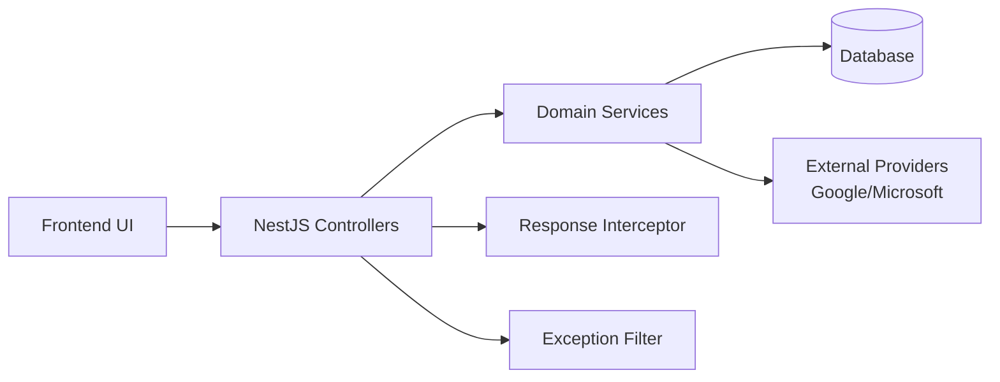

# Architecture

## High-Level Design
Cal3 is a full-stack calendar and reservation platform with a React frontend, a NestJS backend, and PostgreSQL/Azure SQL database support.

```text
Frontend (React + Vite)
  -> HTTP/JSON (JWT + refresh cookie)
Backend (NestJS modules)
  -> TypeORM repositories
Database (PostgreSQL / Azure SQL / SQLite dev)
```

## Core Components
- Frontend: dashboard, calendar views, reservation panels, admin area, context providers.
- Backend modules: auth, calendars/events, calendar-sync, organisations/resources/reservations, tasks, automation, notifications, admin.
- Cross-cutting backend: guards/pipes/filters/interceptors, centralized response/error contracts, common services.

## Component Interactions


## Request/Data Flow
1. Frontend calls API endpoint with access token.
2. Guard/pipe validates auth + input.
3. Service executes business logic.
4. Repository persists/loads data.
5. Response interceptor shapes success envelope.
6. Exception filter shapes error envelope and request tracing.

## Domain Event Flow (Decoupling)
- Services emit domain events through shared event bus.
- Subscribers react asynchronously (automation, sync, notifications), reducing direct module coupling.

## Type System Flow
- Backend source of truth: `backend-nestjs/src/types/*`.
- Frontend mirror: `frontend/src/types/*`.
- Shared contract style: API envelopes + domain enums + DTO request types.