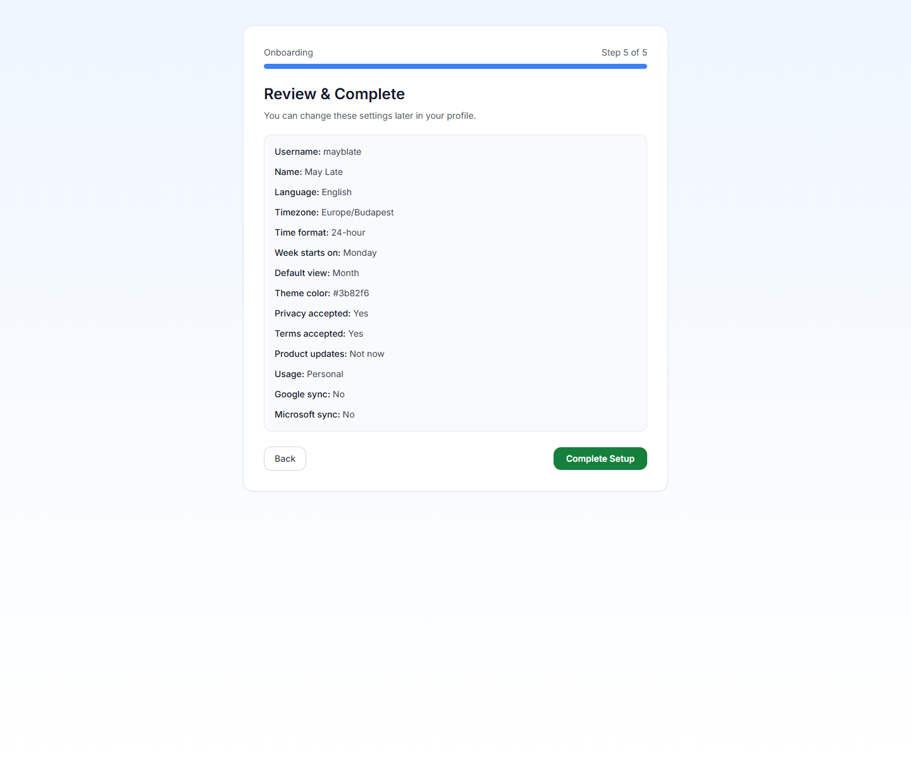

# Everyday Planning FAQ

Use this page for the questions users usually ask after registration: how to get started fast, how to structure calendars, why views behave differently, and where the main product areas live.

## I just signed up. What should I do in the first 10 minutes?

**Short answer:** finish onboarding, create your first real calendar, create one group if you already know you need more than one calendar, then add a real event.

Recommended order:

1. Complete the registration and onboarding flow.
2. Create one calendar you will genuinely use right away.
3. Add a second or third calendar only if you already know the separation matters.
4. Create one event and verify it looks right in Month or Week view.
5. Only then move into Tasks, Automation, or sync.

For the full walkthrough, use [Quick Start Guide](../GETTING-STARTED/quick-start-guide.md) and [Initial Setup](../GETTING-STARTED/first-steps/initial-setup.md).

## I am planning family life. Should I create one calendar or several?

**Short answer:** create separate calendars when visibility, ownership, or color meaning matters.

A realistic family setup is usually clearer with several calendars, for example:

- `Family` for shared appointments and logistics
- `School` for pickup, activities, and parent deadlines
- `Home` for chores, deliveries, and maintenance
- `Personal` for one person's appointments and protected time

Use one calendar when all events follow the same visibility and color logic. Split into several when you want cleaner filters, clearer colors, or easier hiding.

## What is the difference between a calendar and a calendar group?

**Short answer:** a calendar holds events; a calendar group only organizes calendars in the sidebar.

Use a calendar when the events themselves need their own color, sharing, or visibility. Use a group when the calendars already exist and you want a cleaner left-hand structure such as `Family`, `School`, or `Work`.

## I want to hide a calendar for now without deleting it. How?

**Short answer:** toggle its visibility in the sidebar instead of deleting it.

When you hide a calendar:

- its events disappear from Focus, Month, and Week
- the calendar and its events are not deleted
- you can show it again later without rebuilding anything

If you only want to simplify Focus view, do not hide the whole calendar first. Start with Focus-specific label filters instead.

## Why do colors matter so much in PrimeCal?

**Short answer:** color is the fastest way to recognize ownership and context across crowded views.

PrimeCal uses calendar color as the default visual signal in Month and Week. That is why it is worth choosing colors with real meaning, such as:

- blue for family logistics
- green for school or children
- orange for home operations
- red or coral for urgent personal appointments

If color has no meaning, Month and Week become harder to scan.

## Why does Focus show less than Month or Week?

**Short answer:** Focus is intentionally selective, while Month and Week are broader planning views.

Focus can hide items for two different reasons:

- the calendar itself is hidden
- the event uses a label that you configured as hidden from live Focus

This is normal. Focus is supposed to reduce noise for the current moment, while Month and Week stay closer to the full schedule.

## I only want school pickups and appointments in Focus view. How do I hide chores without deleting them?

**Short answer:** use `Profile` and configure `Hide labels from LIVE focus`.

This is the right tool when you want chore-style items to stay visible in Month or Week, but not dominate the live Focus surface. A common pattern is to hide labels such as `routine`, `household`, or `no-focus`.

For the full behavior, use [Focus Mode And Live Focus](../USER-GUIDE/basics/focus-mode-and-live-focus.md).

## Where did Tasks, Automation, External Sync, AI Agents, and Personal Logs go?

**Short answer:** the advanced features are collected under `More`.

PrimeCal keeps daily planning surfaces visible and groups the advanced tools in one predictable place so the workspace stays clean. Use `More` to find:

- `Automation`
- `External Sync`
- `AI Agents (MCP)`
- `Personal logs`

## What should I read next if I want the full explanation instead of the short answer?

- [Creating Your Account](../GETTING-STARTED/first-steps/creating-your-account.md)
- [Calendar Workspace](../USER-GUIDE/calendars/calendar-workspace.md)
- [Calendar Views](../USER-GUIDE/basics/calendar-views.md)
- [Focus Mode And Live Focus](../USER-GUIDE/basics/focus-mode-and-live-focus.md)
