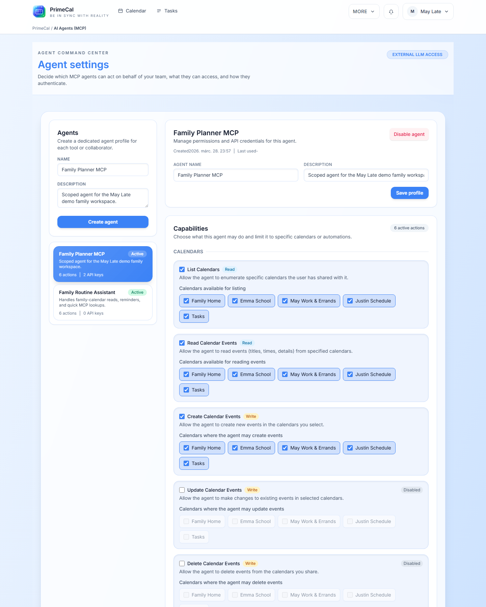
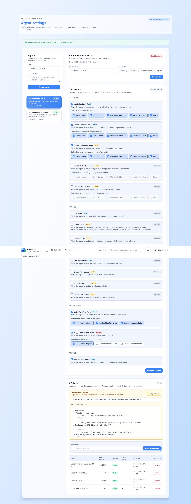

# Automation, Sync, And AI Agents FAQ

These are the power-user questions. Use this page when you are deciding whether PrimeCal should do the work automatically, sync it from elsewhere, or let an AI agent act on your behalf.

## Should I solve this with Automation or with an AI agent?

**Short answer:** use Automation for repeatable in-product rules; use an AI agent when an external tool needs controlled access to PrimeCal.

Choose `Automation` when:

- the trigger is predictable
- the rule should run the same way every time
- the logic lives naturally inside PrimeCal

Choose `AI Agents (MCP)` when:

- an external coding tool or assistant needs access
- permissions must be scoped tightly by feature or calendar
- a human or tool outside PrimeCal is initiating the work

## Can imported events trigger automations?

**Short answer:** yes, imported events can participate in automation when you set the rule up for that workflow.

That makes a strong combination for cases like:

- recoloring imported school calendars
- creating follow-up tasks from imported events
- normalizing titles or descriptions after sync

Start small and verify one real example before building a larger rule set.

## I connected Google or Microsoft. What should I sync first?

**Short answer:** start with one or two calendars that you genuinely need, not your whole account.

The safest first connection is a small, meaningful set such as:

- one shared family calendar
- one school or work calendar

This makes it easier to catch naming, color, duplication, and recurrence issues before the setup gets wide.

## A synced calendar looks duplicated or messy. What is the safest fix?

**Short answer:** simplify first, then reconnect cleanly if needed.

Work in this order:

1. confirm which calendars are actually mapped
2. reduce the connection to the smallest useful set
3. re-check whether two-way behavior is appropriate
4. if the mapping is wrong, disconnect and reconnect cleanly instead of stacking more changes on top

## Can an AI agent read my whole account by default?

**Short answer:** no. PrimeCal agents are meant to be permissioned and scoped.

The safest approach is to grant:

- only the actions the tool needs
- only the calendars or automation rules it needs
- only one key per tool or workflow

## What is the safest first test after creating an agent?

**Short answer:** test one low-risk read or one low-risk write against a non-critical calendar.

Good examples:

- list events from one test calendar
- create one test task
- trigger one non-destructive automation rule

Do not start with a broad write scope or a production-critical calendar.

## Do I need one agent per tool?

**Short answer:** yes, in most cases that is the cleaner and safer pattern.

Separate agents make it easier to:

- understand who or what the key belongs to
- revoke one client without affecting others
- narrow permissions accurately

## Can I combine sync, automation, and AI agents?

**Short answer:** yes, but layer them in that order of stability.

Best-practice rollout:

1. get the external sync result correct
2. add one automation rule
3. add an AI agent only after you understand the stable data shape

## Where should I go next?

- [Introduction To Automation](../USER-GUIDE/automation/introduction-to-automation.md)
- [Managing And Running Automations](../USER-GUIDE/automation/managing-and-running-automations.md)
- [External Sync](../USER-GUIDE/integrations/external-sync.md)
- [Agent Configuration](../USER-GUIDE/agents/agent-configuration.md)
