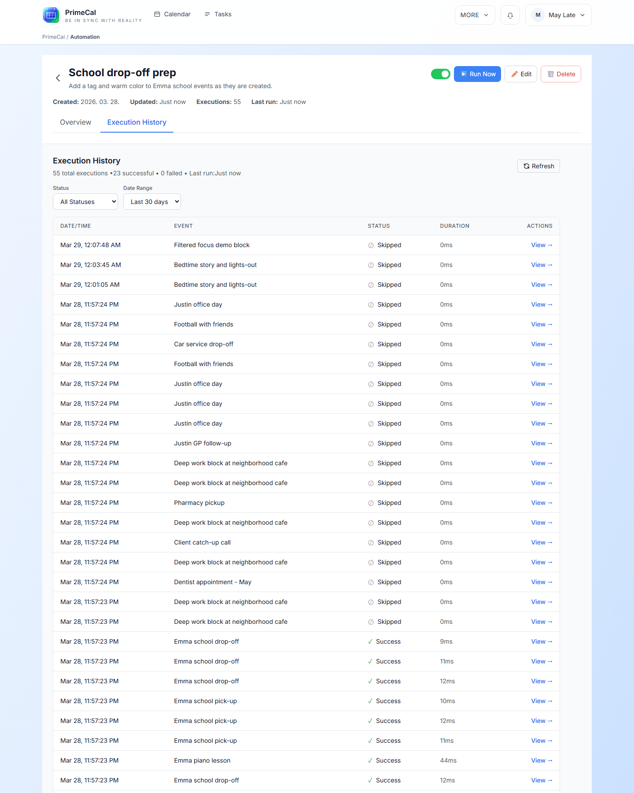

# Troubleshooting FAQ

This page is for the moment when something exists in PrimeCal, but the screen is not behaving the way you expect.

## An event exists, but I cannot find it. What should I check first?

**Short answer:** check visibility before you check everything else.

Work in this order:

1. confirm the calendar is visible in the sidebar
2. confirm you are looking at the right date range
3. confirm the event is not filtered out by Focus-only label rules
4. confirm your timezone and event time are what you think they are

Month and Week are usually the fastest places to confirm whether the event is truly missing or just filtered.

## Why does an event appear in Month or Week but not in Focus?

**Short answer:** Focus is filtered more aggressively by design.

The usual reason is that the event carries a label hidden from live Focus, or the current live moment no longer matches the event you expected to see.

## A task due date is not where I expected. What controls that?

**Short answer:** the default Tasks calendar controls where mirrored task timing appears.

If task timing looks strange, re-check:

- whether the task has a due date
- whether the due time was intentionally left blank
- which calendar is acting as the default Tasks calendar

For the full explanation, use [Tasks Workspace](../USER-GUIDE/tasks/tasks-workspace.md) and [Profile Page](../USER-GUIDE/profile/profile-page.md).

## Why did my automation not run?

**Short answer:** most misses come from the rule not being enabled, the trigger not matching, or a condition filtering the event out.

Check these in order:

1. the rule is enabled
2. the trigger matches the actual event change
3. the conditions are not too narrow
4. the action is still valid for the data it receives
5. the execution history shows what happened

## Why can’t my agent perform an action it used to perform?

**Short answer:** the scope, key, or allowed actions probably changed.

Re-check:

- whether the agent still has the required action enabled
- whether the specific calendar or rule is still in scope
- whether the key was revoked or rotated
- whether you are pointing the client at the latest generated MCP configuration

## Why does external sync look stale after I changed provider settings?

**Short answer:** sync connections are easiest to recover by simplifying them, not by layering more changes onto a broken mapping.

Reduce the setup to the smallest useful test case, then reconnect cleanly if the provider account or mapping changed. This is especially important after switching Google or Microsoft accounts.

## When should I stop troubleshooting and open the deeper docs?

Move from FAQ to the full docs when:

- you need the exact click path, not just the quick answer
- you are changing more than one feature at once
- the problem spans sync, automation, and agents together

Use these pages next:

- [Calendar Views](../USER-GUIDE/basics/calendar-views.md)
- [Focus Mode And Live Focus](../USER-GUIDE/basics/focus-mode-and-live-focus.md)
- [Managing And Running Automations](../USER-GUIDE/automation/managing-and-running-automations.md)
- [External Sync](../USER-GUIDE/integrations/external-sync.md)
