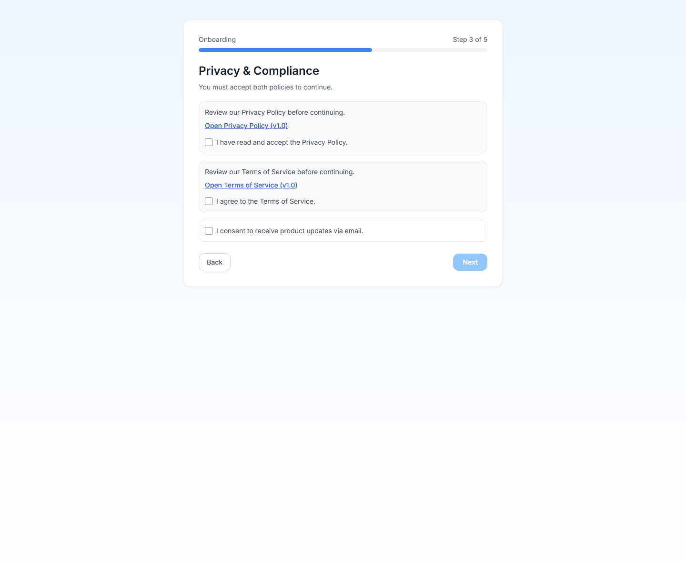
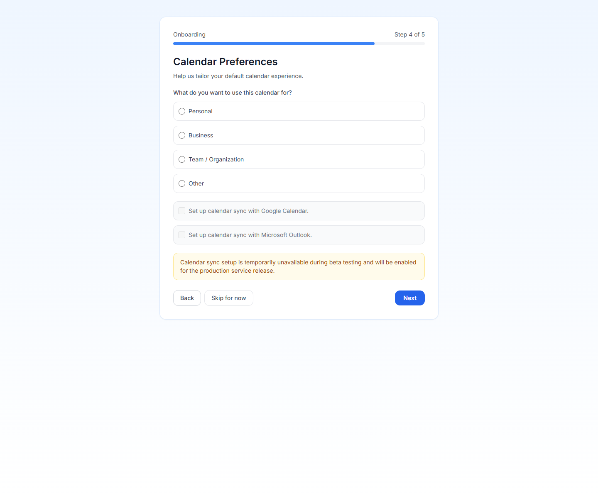

# Creating Your Account

PrimeCal starts with a compact sign-up form, then moves immediately into a five-step onboarding wizard. The goal is to collect only the information needed to make the calendar usable from the first session.

## Step 1: Open Sign Up

1. Open the PrimeCal sign-in page.
2. Switch to `Sign up`.
3. Fill the three visible fields.
4. Submit `Create account`.

## Registration Fields

| Field | Required | What to enter | Rules and constraints |
| --- | --- | --- | --- |
| Username | Yes | Your public account name | 3 to 64 characters. Use letters, numbers, dots, or underscores. Must be unique. |
| Email address | Yes | Your sign-in email | Must be a valid email address and must be unique. |
| Password | Yes | A secure password | Minimum 6 characters. The password helper must show a valid result before you continue. |

## What Happens After Registration

After the account is created, PrimeCal signs you in and opens the onboarding wizard automatically. Until that wizard is finished, the product keeps you on the setup path instead of dropping you into the main workspace.

## Step 2: Complete The Five Wizard Steps

### 1. Welcome Profile

- Optional first name
- Optional last name
- Optional Gravatar-based profile image

### 2. Personalization

- Language
- Timezone
- Time format
- Week start day
- Default calendar view
- Theme color

### 3. Privacy And Consent

- Privacy policy acceptance: required
- Terms of service acceptance: required
- Product updates by email: optional

You cannot complete setup until both required checkboxes are accepted.

### 4. Calendar Preferences

- Main use case: personal, business, team, or other
- Optional request to connect Google Calendar later
- Optional request to connect Microsoft Calendar later

### 5. Review

PrimeCal shows a summary of the choices you made so you can confirm them before `Complete Setup`.

## After Setup

When the wizard finishes, PrimeCal sends you into the main app with:

- your profile basics saved
- your locale and view preferences applied
- privacy acceptance recorded
- a default `Tasks` calendar already created for you

Your next step should be [Initial Setup](./initial-setup.md), where you create a normal calendar and organize your sidebar.

## Best Practices

- Pick the timezone carefully on first run because it affects every event you create afterward.
- Use a distinct username you are comfortable sharing with collaborators.
- Treat the optional sync toggles as later setup choices, not something you must finish before using the app.
- Go back to the [Profile Page](../../USER-GUIDE/profile/profile-page.md) later if you want to refine labels, focus behavior, or appearance.

## Developer Reference

If you are implementing or testing the registration flow, use the [Authentication API](../../DEVELOPER-GUIDE/api-reference/authentication-api.md).
