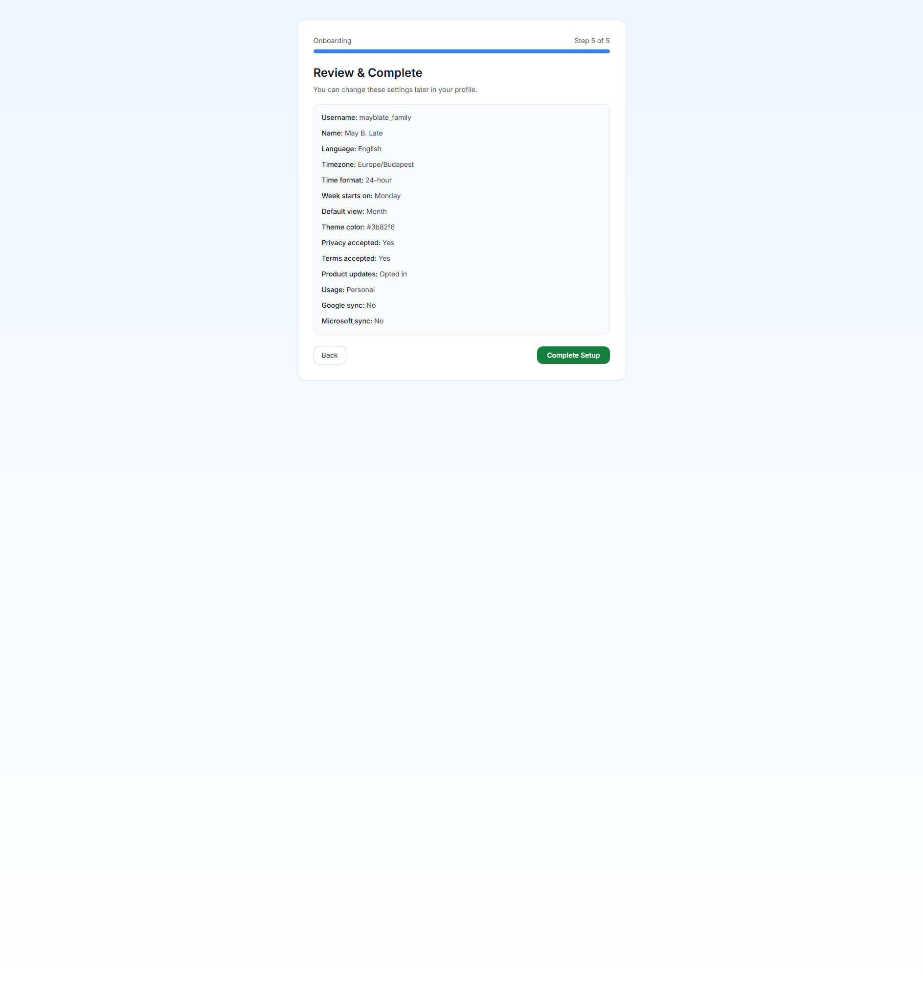
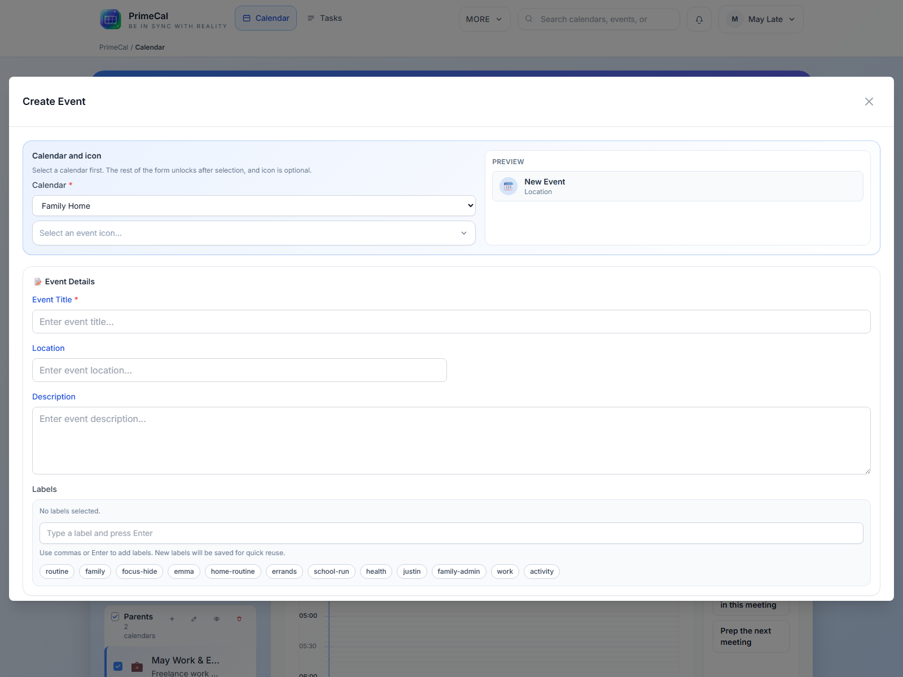

  
Fast Path

  <h1 class="pc-guide-hero__title">Quick Start Guide</h1>
  
Use this page when you want the full first-run sequence in one place. It mirrors the same screens a new PrimeCal user sees in the live product.

  

    Account creation
    Onboarding wizard
    Calendar groups
    First event
  

## The Fast Path

  <article class="pc-guide-flow__item">
    
1

    <h3>Create Your Account</h3>
    
Open `Sign up`, enter your username, email address, and password, then submit `Create account`.

  </article>
  <article class="pc-guide-flow__item">
    
2

    <h3>Complete The Wizard</h3>
    
Finish the five onboarding steps for profile, personalization, privacy, calendar preferences, and review.

  </article>
  <article class="pc-guide-flow__item">
    
3

    <h3>Create Your Calendar</h3>
    
Use `New Calendar` to create a normal calendar such as `Family`, `Personal`, or `Work`.

  </article>
  <article class="pc-guide-flow__item">
    
4

    <h3>Organize Groups</h3>
    
Create a group if you want to keep multiple calendars together in the sidebar.

  </article>
  <article class="pc-guide-flow__item">
    
5

    <h3>Create Your First Event</h3>
    
Use `New Event` or click directly in a calendar view, then save the event through the shared modal.

  </article>

## What You Will Configure

- account identity and secure sign-in
- language, timezone, time format, week start, and default view
- privacy acceptance and optional product-update consent
- at least one regular calendar and optional calendar groups
- the first real event in the month, week, or focus workflow

## Screens You Will See

## Best Practices For New Users

- Finish the full onboarding flow before trying to configure advanced features like sync, automation, or AI agents.
- Create a regular calendar before creating lots of events so your day-to-day schedule does not mix with the default tasks calendar.
- Choose calendar colors early and keep them consistent across family, work, and personal spaces.
- Add only the groups you need. Too many groups make the sidebar harder to scan.

## Continue With The Detailed Pages

1. [Creating Your Account](./first-steps/creating-your-account.md)
2. [Initial Setup](./first-steps/initial-setup.md)
3. [Creating Your First Event](./first-steps/creating-your-first-event.md)
4. [User Documentation](../USER-GUIDE/index.md)
