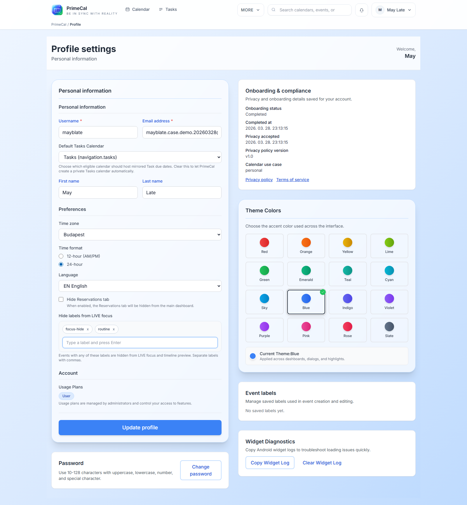

# Focus Mode And Live Focus

PrimeCal has two related Focus behaviors:

- `Live Focus` in the normal Timeline workspace
- `Clean focus mode`, which removes most surrounding chrome and leaves only the current timeline context

## Enter Clean Focus Mode

1. Open `Calendar`.
2. Switch to `Timeline` if needed.
3. Click `Clean focus mode`.
4. Click `Exit focus mode` when you want the full workspace back.

## What Hidden Focus Labels Do

Use `Profile` -> `Hide labels from LIVE focus` when you want some events to stay on the calendar but stay out of the live-focus surface.

- Events with those labels still appear in Month view.
- They still appear in Week view.
- They are removed from the live Focus card and the timeline preview strip.

## How The Quiet State Looks

When the current event is filtered out, or when there is no matching live event, Focus switches to the quiet state.

## When To Use It

- Hide labels such as `routine`, `household`, or `no-focus` when those items clutter the live view.
- Keep family logistics visible in Month or Week view while protecting the current-focus surface.
- Use clean focus mode on a second screen when you want a simplified timeline during the day.
