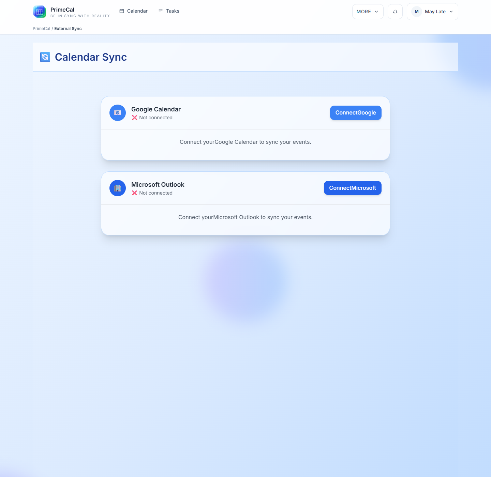

# External Sync

External Sync lets you connect PrimeCal to supported external calendar providers and decide which calendars stay linked.

## How To Open It

1. Open `More`.
2. Select `External Sync`.

## Typical Setup Flow

1. Choose a provider such as Google or Microsoft.
2. Start the connection flow from the sync screen.
3. Return to PrimeCal after the provider confirms access.
4. Select the calendars you want to sync.
5. Decide whether each connection should stay two-way.
6. Save the mapping.

## What To Decide Carefully

| Decision | Why it matters |
| --- | --- |
| Which calendars to connect | Not every external calendar belongs in PrimeCal |
| Two-way sync | Useful when both systems must stay current |
| Which rules to trigger | Helpful when imported items should kick off automation |

## When To Disconnect Or Reconnect

- a provider account changed
- the wrong calendars were linked
- sync looks stale and you want a clean restart
- you want to reduce what external systems can write back

## Best Practices

- Start with one or two calendars, not everything at once.
- Use automation only after the basic sync result looks correct.
- Recheck titles, colors, and recurring items after the first sync.
- Disconnect cleanly before reconnecting a provider with a different account.

## Developer Reference

For OAuth, mapping payloads, and force-sync behavior, use the [External Sync API](../../DEVELOPER-GUIDE/api-reference/sync-api.md).
