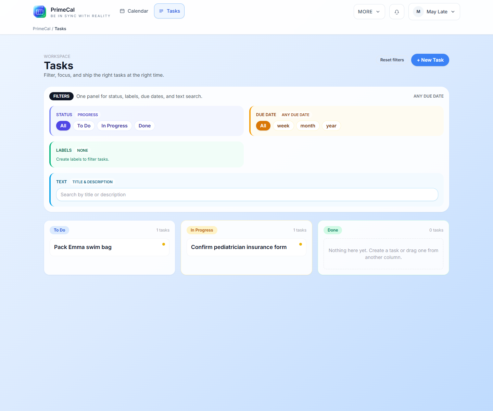
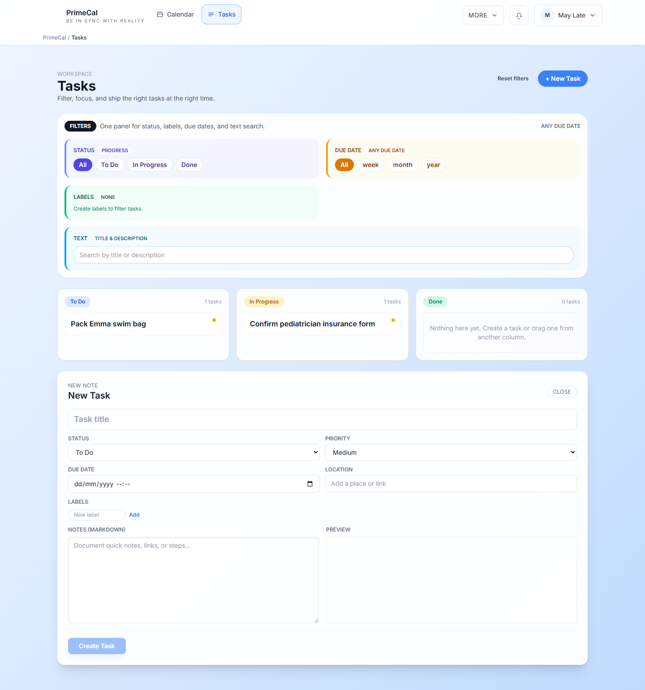

# Tasks Workspace

PrimeCal keeps tasks close to the calendar so you can move between time-based planning and actionable work without switching products.

## How To Open It

1. Open the main workspace.
2. Select `Tasks`.

## What The Tasks Workspace Includes

| Area | What it is for |
| --- | --- |
| Task list | The main board for active work |
| Filters | Narrow by status, labels, or search |
| Quick create | Add a task without leaving the workspace |
| Detail composer | Fill in due dates, labels, notes, and color |

## Quick Create

Use quick create when you want to capture something fast before you forget it.

Examples:

- grocery follow-up
- school paperwork
- appointments to schedule
- packing or travel prep

## Good Task Habits

- Use labels for areas such as `School`, `Home`, or `Errands`.
- Keep titles short and action-oriented.
- Add due dates only when timing truly matters.
- Use the default Tasks calendar for task-related planning instead of mixing these items into normal event calendars.

## Developer Reference

For task contracts and label routes, use the [Tasks API](../../DEVELOPER-GUIDE/api-reference/tasks-api.md).
