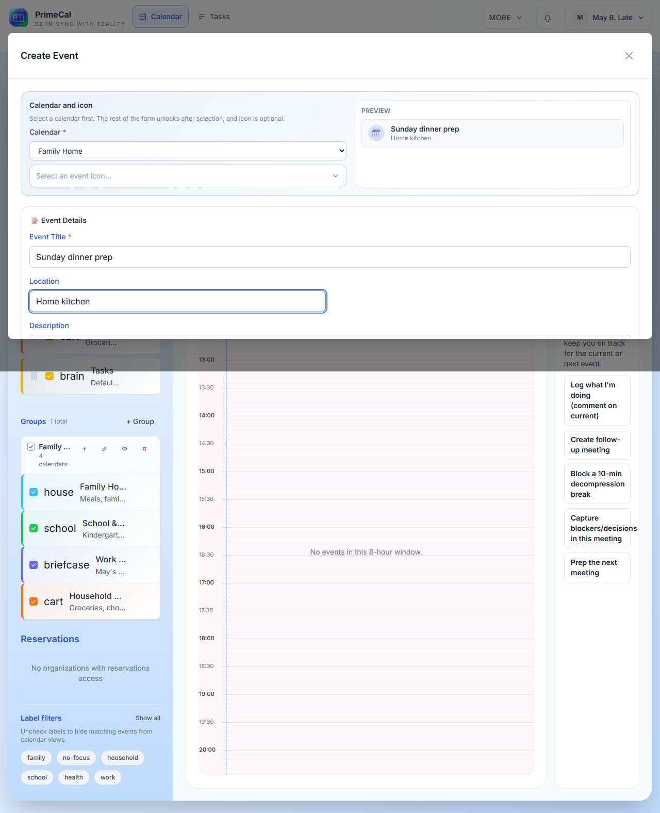

<div class="pc-guide-hero">
  <p class="pc-guide-hero__eyebrow">PrimeCal Docs</p>
  <h1 class="pc-guide-hero__title">A Clean Path From Sign-Up To API Integration</h1>
  <p class="pc-guide-hero__lead">This portal is organized around the actual PrimeCal product flow. Start with registration and setup, continue into daily calendar work, then move into automation, agent configuration, and the full API reference.</p>
  <div class="pc-guide-chip-row">
    <span class="pc-guide-chip">Product-backed</span>
    <span class="pc-guide-chip">PrimeCal colors</span>
    <span class="pc-guide-chip">Screenshot-ready</span>
    <span class="pc-guide-chip">Docusaurus portal</span>
  </div>
</div>

## Choose Your Path

<div class="pc-guide-grid">
  <article class="pc-guide-card pc-guide-card--accent">
    <p class="pc-guide-card__eyebrow">Start here</p>
    <h3><a href="/GETTING-STARTED">Getting Started</a></h3>
    <p>Register, complete onboarding, create your first calendar, group calendars, and add your first event.</p>
  </article>
  <article class="pc-guide-card">
    <p class="pc-guide-card__eyebrow">Daily use</p>
    <h3><a href="/USER-GUIDE">User Documentation</a></h3>
    <p>Profile settings, calendar workspace, event creation, views, automation, and AI agent setup.</p>
  </article>
  <article class="pc-guide-card">
    <p class="pc-guide-card__eyebrow">Integrate</p>
    <h3><a href="/DEVELOPER-GUIDE">Developer Documentation</a></h3>
    <p>Swagger-style API guidance for auth, users, calendars, events, automation, agents, and MCP.</p>
  </article>
  <article class="pc-guide-card">
    <p class="pc-guide-card__eyebrow">Support</p>
    <h3><a href="/FAQ">FAQ</a></h3>
    <p>Quick answers for common setup and usage questions without leaving the documentation path.</p>
  </article>
</div>

## Most Common Journeys

<div class="pc-guide-flow">
  <article class="pc-guide-flow__item">
    <div class="pc-guide-flow__index">1</div>
    <h3>Register</h3>
    <p>Go to <a href="/GETTING-STARTED/first-steps/creating-your-account">Creating Your Account</a> for field rules, live validation, and the onboarding wizard.</p>
  </article>
  <article class="pc-guide-flow__item">
    <div class="pc-guide-flow__index">2</div>
    <h3>Set up calendars</h3>
    <p>Use <a href="/GETTING-STARTED/first-steps/initial-setup">Initial Setup</a> and <a href="/USER-GUIDE/calendars/calendar-workspace">Calendar Workspace</a> to create calendars and groups.</p>
  </article>
  <article class="pc-guide-flow__item">
    <div class="pc-guide-flow__index">3</div>
    <h3>Start planning</h3>
    <p>Read <a href="/USER-GUIDE/basics/creating-events">Creating Events</a> and <a href="/USER-GUIDE/basics/calendar-views">Calendar Views</a> to understand how scheduling behaves in each view.</p>
  </article>
  <article class="pc-guide-flow__item">
    <div class="pc-guide-flow__index">4</div>
    <h3>Automate or connect</h3>
    <p>Continue into <a href="/USER-GUIDE/automation/introduction-to-automation">Automation</a>, <a href="/USER-GUIDE/agents/agent-configuration">Agent Configuration</a>, and <a href="/DEVELOPER-GUIDE/api-reference/api-overview">API Overview</a>.</p>
  </article>
</div>

## Recommended Reading Order

1. [Quick Start Guide](./GETTING-STARTED/quick-start-guide.md)
2. [User Documentation](./USER-GUIDE/index.md)
3. [Developer Documentation](./DEVELOPER-GUIDE/index.md)
4. [FAQ](./FAQ/index.md)

## Screenshot Notes

The new pages already include screenshot placeholders where the UI matters most. You can either:

- put files under `docs/assets/...` and reference them with relative markdown paths
- put files under `docs-portal/static/img/...` and reference them with `/img/...` paths

Example:

```md

```

Or from `docs-portal/static/img`:

```md

```
